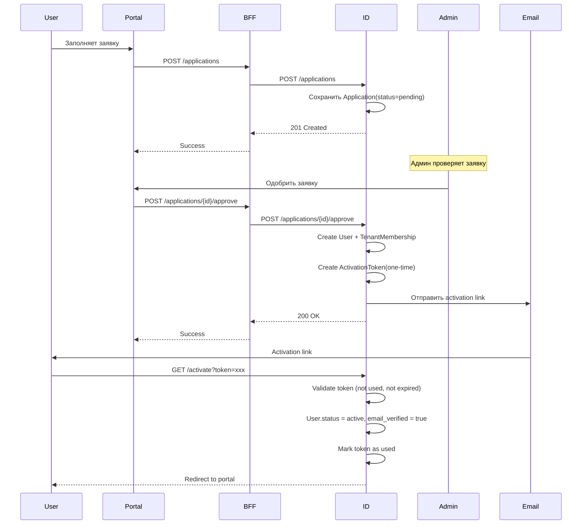
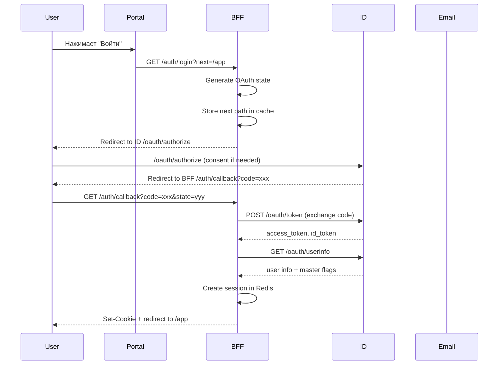
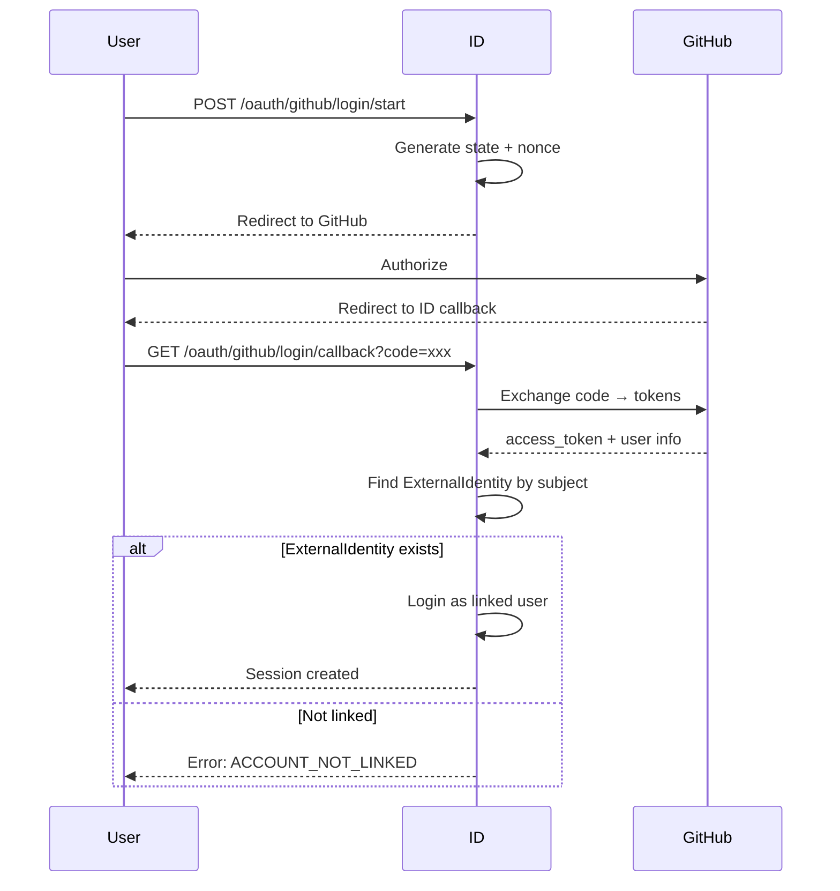
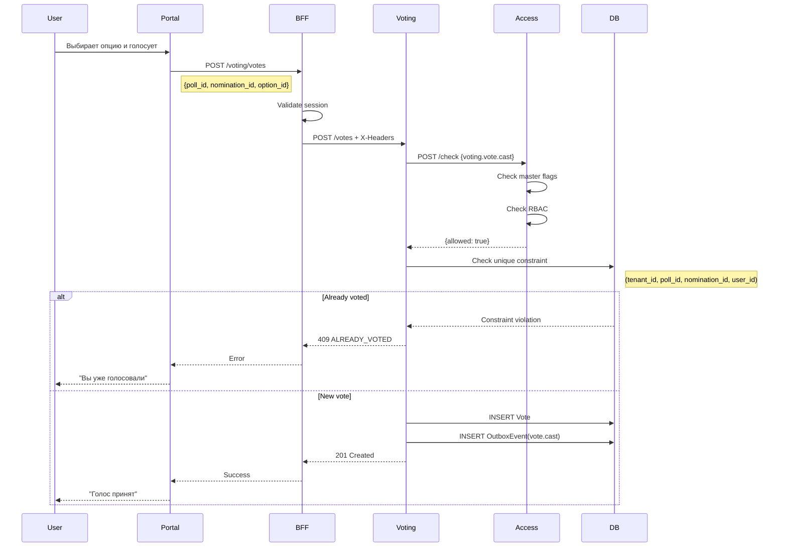
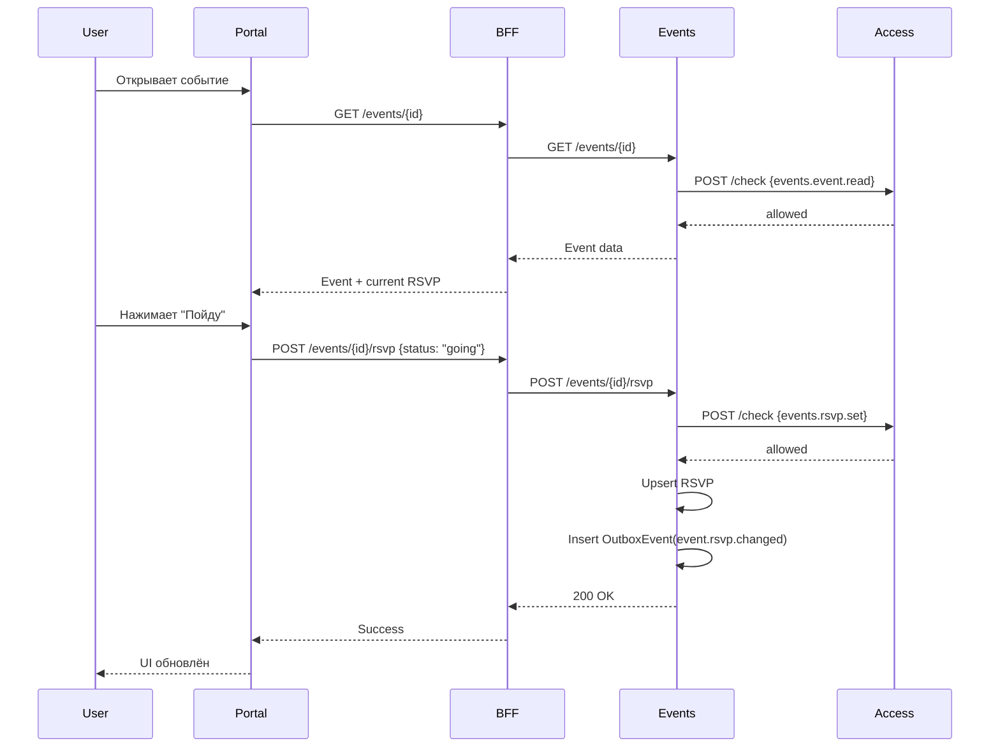
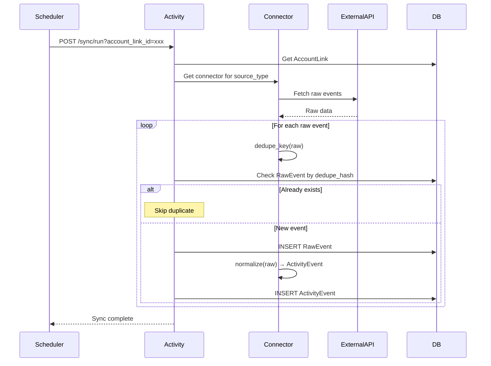
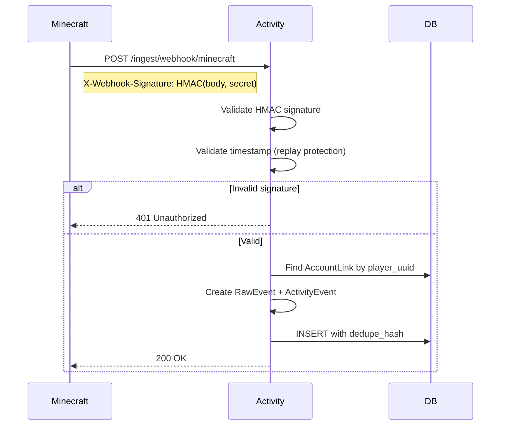
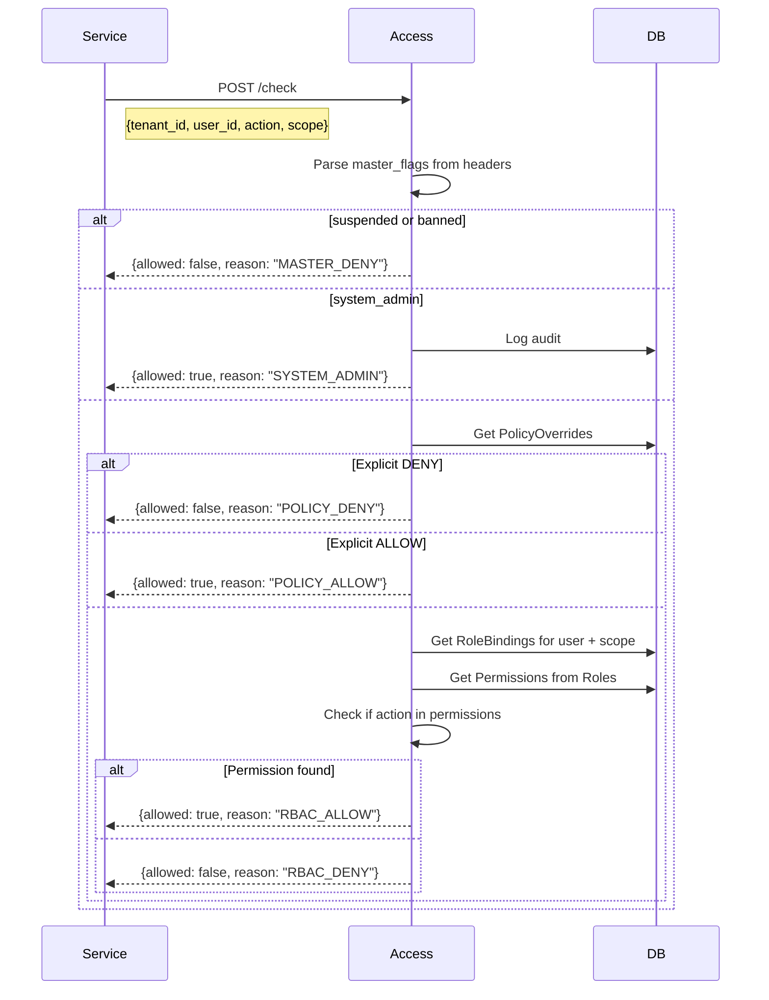

# Основные потоки

## Регистрация и активация

### Application → Approve → Activate

## Аутентификация

### Magic Link Login

### OAuth Provider Login (уже привязан)

## Голосование

### Cast Vote

## События

### RSVP Flow

## Activity Feed

### Sync + Normalize

### Webhook Ingest (Minecraft)

## Проверка доступа

### Access Check Flow

