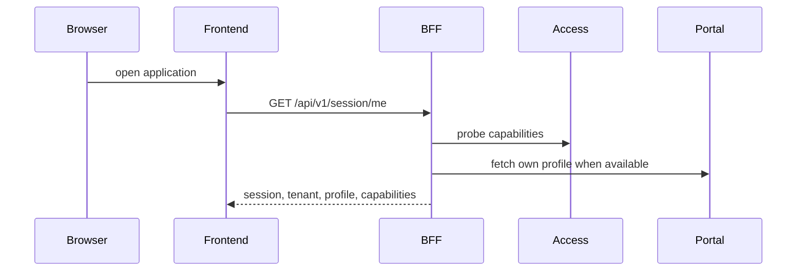
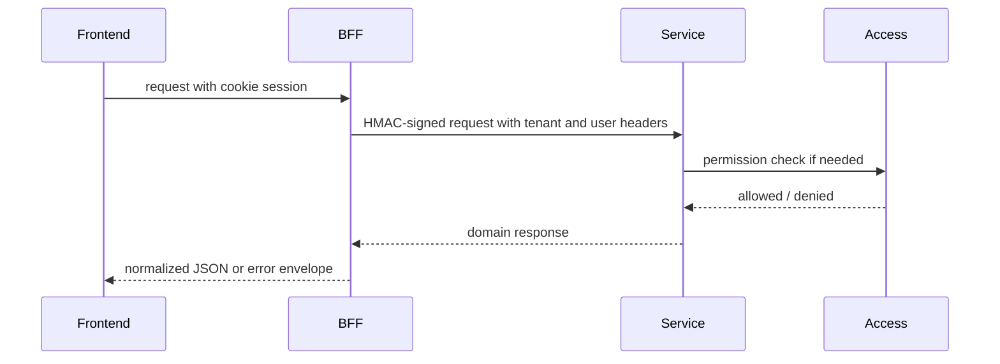
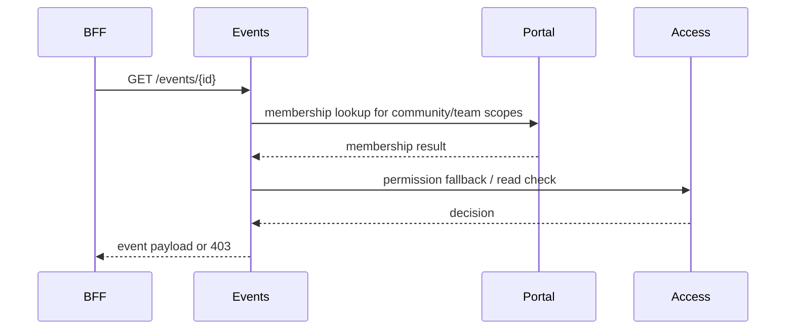
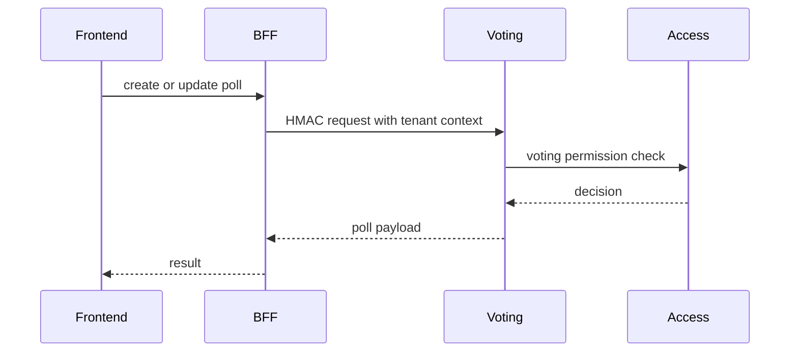
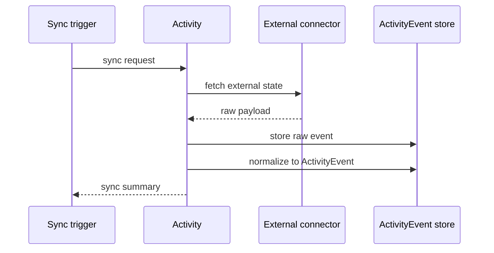

# Request Flows

В этом разделе собраны высокосигнальные runtime flows, которые чаще всего приходится понимать при изменениях.

## 1. Session bootstrap

```mermaid
sequenceDiagram
    participant Browser
    participant Frontend
    participant BFF
    participant Access
    participant Portal

    Browser->>Frontend: open application
    Frontend->>BFF: GET /api/v1/session/me
    BFF->>Access: probe capabilities
    BFF->>Portal: fetch own profile when available
    BFF-->>Frontend: session, tenant, profile, capabilities
```

## 2. Authenticated domain request

```mermaid
sequenceDiagram
    participant Frontend
    participant BFF
    participant Service
    participant Access

    Frontend->>BFF: request with cookie session
    BFF->>Service: HMAC-signed request with tenant and user headers
    Service->>Access: permission check if needed
    Access-->>Service: allowed / denied
    Service-->>BFF: domain response
    BFF-->>Frontend: normalized JSON or error envelope
```

## 3. Event visibility check

```mermaid
sequenceDiagram
    participant BFF
    participant Events
    participant Portal
    participant Access

    BFF->>Events: GET /events/{id}
    Events->>Portal: membership lookup for community/team scopes
    Portal-->>Events: membership result
    Events->>Access: permission fallback / read check
    Access-->>Events: decision
    Events-->>BFF: event payload or 403
```

## 4. Poll management in tenant voting

```mermaid
sequenceDiagram
    participant Frontend
    participant BFF
    participant Voting
    participant Access

    Frontend->>BFF: create or update poll
    BFF->>Voting: HMAC request with tenant context
    Voting->>Access: voting permission check
    Access-->>Voting: decision
    Voting-->>BFF: poll payload
    BFF-->>Frontend: result
```

## 5. Feed ingestion through connectors

```mermaid
sequenceDiagram
    participant Scheduler as Sync trigger
    participant Activity
    participant Connector as External connector
    participant Feed as ActivityEvent store

    Scheduler->>Activity: sync request
    Activity->>Connector: fetch external state
    Connector-->>Activity: raw payload
    Activity->>Feed: store raw event
    Activity->>Feed: normalize to ActivityEvent
    Activity-->>Scheduler: sync summary
```

## Когда обновлять этот раздел

Обновляйте диаграммы, если меняется хотя бы одно из следующего:

- кто принимает authoritative decision;
- какой сервис вызывает другой сервис;
- где материализуется session;
- где появляются новые side effects или outbox events.
