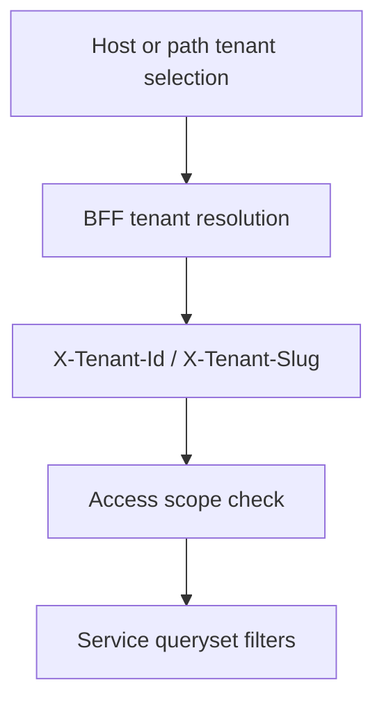

# Multi-Tenancy

Tenant isolation в UpdSpace завязана не на один механизм, а на комбинацию маршрутизации, internal context headers, permission scopes и фильтрации в моделях.

## Tenant sources

Платформа поддерживает два режима tenant routing:

- subdomain-oriented режим, когда tenant виден из host;
- path-based frontend routing через `/t/:tenantSlug/*`.

BFF связывает оба режима и приводит их к одному внутреннему представлению:

- `tenant_id`
- `tenant_slug`
- `user_id`
- `master_flags`

## Isolation layers

## Scope model

В коде встречаются как минимум такие scope types:

- `TENANT`
- `COMMUNITY`
- `TEAM`
- дополнительные доменные scope values в отдельных сервисах

Не каждый сервис обязан одинаково поддерживать все scope types, но он обязан явно определять, на какой scope опирается при authorization.

## Где tenant важен особенно сильно

| Service | Как tenant участвует |
| --- | --- |
| BFF | выбирает активный tenant и передает его downstream |
| Access | вычисляет effective access в tenant и scope context |
| Portal | все профили, communities, teams и posts привязаны к tenant |
| Voting | новые poll-модели tenant-aware; legacy слой требует отдельной осторожности |
| Events | visibility и membership checks выполняются внутри tenant |
| Gamification | categories, achievements, grants живут в tenant |
| Activity | feed, news, connectors, subscriptions и account links фильтруются по tenant |

## Типовые ошибки

- detail endpoint получает объект только по `id`, а не по `id + tenant_id`;
- внутренний сервис доверяет только `user_id`, но не сверяет tenant;
- compat layer возвращает legacy identifier, который не гарантирует tenant scoping;
- background job нормализует или импортирует данные без явного tenant context.

## Что должен делать новый модуль

Если вы добавляете новый tenant-aware домен:

1. храните `tenant_id` в модели;
2. фильтруйте `queryset` по tenant до любой бизнес-логики;
3. проверяйте permission через Access;
4. документируйте scope_type/scope_id, который используется для authorization;
5. добавляйте тест на cross-tenant isolation.
