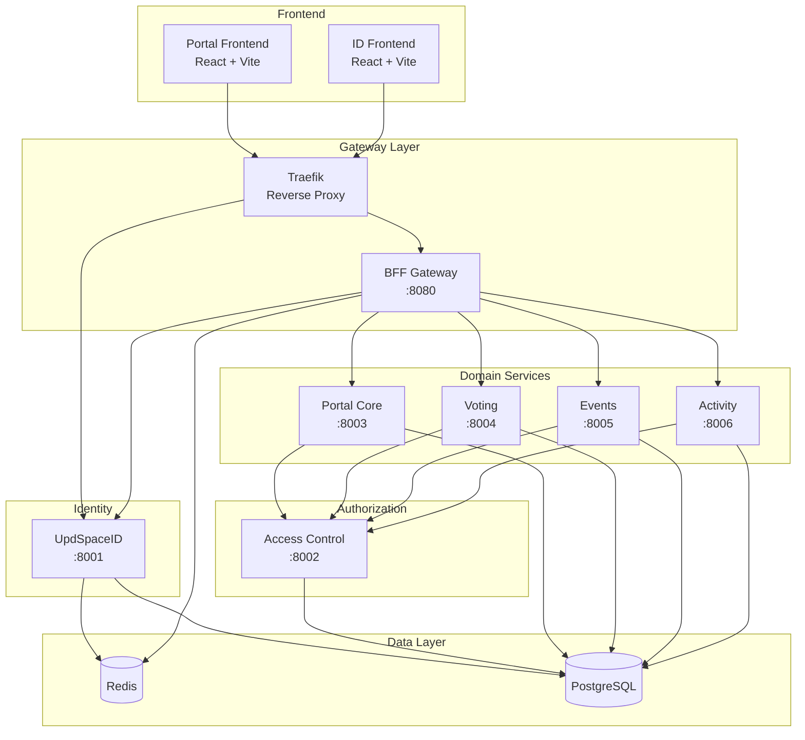

# Обзор архитектуры

UpdSpace построен как **микросервисная платформа** с BFF-паттерном и централизованной авторизацией.

## Диаграмма сервисов



## Сервисы

| Сервис | Порт | Назначение | Зависимости |
|--------|------|------------|-------------|
| **UpdSpaceID** | 8001 | Identity Provider, SSO, OAuth | Postgres, Redis |
| **BFF** | 8080 | API Gateway, Sessions | Redis, ID, все сервисы |
| **Access** | 8002 | RBAC, Permission checks | Postgres |
| **Portal** | 8003 | Communities, Teams, Posts | Postgres, Access |
| **Voting** | 8004 | Polls, Votes, Results | Postgres, Access |
| **Events** | 8005 | Calendar, RSVP, Attendance | Postgres, Access |
| **Activity** | 8006 | Feed, Connectors | Postgres |

## Матрица зависимостей

```
            │ ID  │ Access │ BFF │ Portal │ Voting │ Events │ Activity │
────────────┼─────┼────────┼─────┼────────┼────────┼────────┼──────────┤
ID          │  -  │   ❌   │ ❌  │   ❌   │   ❌   │   ❌   │    ❌    │
Access      │ ❌  │   -    │ ❌  │   ❌   │   ❌   │   ❌   │    ❌    │
BFF         │ ✅  │   ❌   │  -  │   ✅   │   ✅   │   ✅   │    ✅    │
Portal      │ ❌  │   ✅   │ ❌  │   -    │   ❌   │   ❌   │    ❌    │
Voting      │ ❌  │   ✅   │ ❌  │   ❌   │   -    │   ❌   │    ❌    │
Events      │ ❌  │   ✅   │ ❌  │   ✅   │   ❌   │   -    │    ❌    │
Activity    │ ❌  │   ✅   │ ❌  │   ❌   │   ❌   │   ❌   │    -     │

Легенда: ✅ = зависит от, ❌ = не зависит
```

## Технологический стек

### Backend
- **Python 3.12+**
- **Django 5.x** — ORM, миграции
- **Django Ninja** — REST API (OpenAPI автогенерация)
- **PostgreSQL** — основное хранилище
- **Redis** — кэш, сессии BFF

### Frontend
- **React 19+**
- **Vite** — сборка
- **Gravity UI** — UI библиотека
- **Bootstrap 5** — сетка

### Infrastructure
- **Docker Compose** — локальная разработка
- **Traefik** — reverse proxy, routing по subdomain

## Коммуникация между сервисами

### External → BFF
- HTTP REST через Traefik
- Session cookie (HttpOnly, SameSite=Lax)

### BFF → Services
- HTTP REST с HMAC-подписью
- Headers:
  - `X-Request-Id`
  - `X-Tenant-Id`, `X-Tenant-Slug`
  - `X-User-Id`
  - `X-Master-Flags` (suspended, system_admin, etc.)
  - `X-Updspace-Timestamp`, `X-Updspace-Signature`

### Services → Access
- HTTP REST для проверки permissions
- Синхронный запрос при каждом действии

### Outbox Pattern
- Domain events записываются в outbox-таблицу
- Activity Service полит outbox и нормализует в feed

## Конвенции

### Формат ошибок
```json
{
  "error": {
    "code": "ERROR_CODE",
    "message": "Human readable message",
    "details": {},
    "request_id": "uuid"
  }
}
```

### Timestamps
- Все даты в UTC
- Формат: ISO 8601 (`2026-01-14T12:00:00Z`)

### IDs
- UUID v4 для всех primary keys
- `tenant_id` обязателен во всех tenant-scoped таблицах
