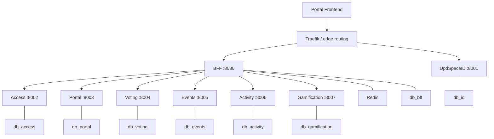
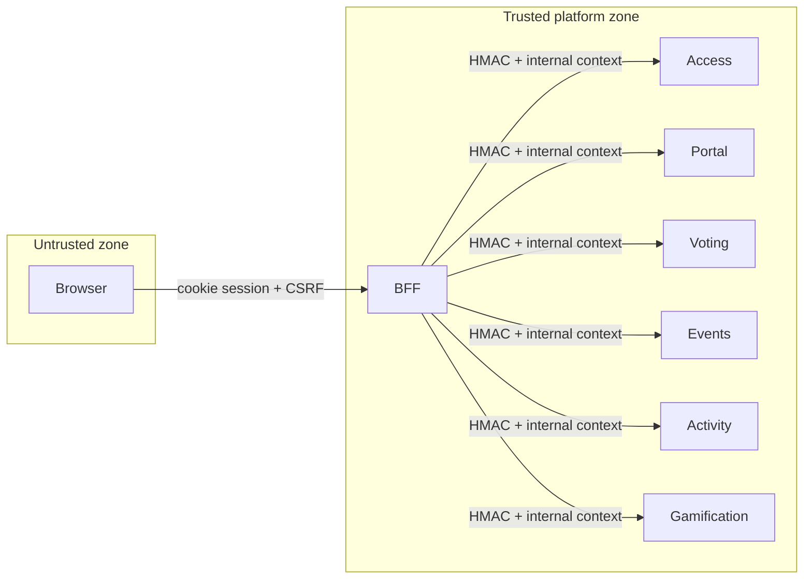

# Architecture Overview

UpdSpace построен как набор Django-сервисов вокруг одного browser entrypoint. Снаружи пользователь видит один продукт, но внутри платформа разделена на доменные сервисы с отдельными базами данных и отдельными API.

## Runtime topology

```mermaid
flowchart TB
    Browser["Portal Frontend"] --> Traefik["Traefik / edge routing"]
    Traefik --> BFF["BFF :8080"]
    Traefik --> ID["UpdSpaceID :8001"]

    BFF --> Access["Access :8002"]
    BFF --> Portal["Portal :8003"]
    BFF --> Voting["Voting :8004"]
    BFF --> Events["Events :8005"]
    BFF --> Activity["Activity :8006"]
    BFF --> Gamification["Gamification :8007"]

    BFF --- Redis["Redis"]

    Access --- DBA["db_access"]
    Portal --- DBP["db_portal"]
    Voting --- DBV["db_voting"]
    Events --- DBE["db_events"]
    Activity --- DBAct["db_activity"]
    Gamification --- DBG["db_gamification"]
    BFF --- DBB["db_bff"]
    ID --- DBID["db_id"]
```

## Architecture slices

Платформу полезно читать не только по сервисам, но и по архитектурным слоям:

| Slice | Components | Role |
| --- | --- | --- |
| Edge and browser | portal frontend, Traefik | UI, routing, asset delivery |
| Session and gateway | BFF | browser session, auth orchestration, upstream proxying |
| Policy plane | Access | permissions, rollout, personalization |
| Domain plane | Portal, Voting, Events, Gamification, Activity | business state and workflows |
| Identity plane | UpdSpaceID | identity authority, MFA, passkeys |
| Infrastructure plane | Postgres, Redis, object storage and provider integrations | persistence and supporting services |

## Что считается каноническим path

- **Frontend -> BFF**: единственный поддерживаемый browser path.
- **BFF -> services**: internal HMAC calls с tenant и user context headers.
- **Services -> Access**: permission checks и scope membership lookups.
- **Services -> peer services**: только там, где это прямо заложено в коде и оправдано доменной связью.

## Основные bounded contexts

| Context | Service | Что хранит |
| --- | --- | --- |
| Identity | UpdSpaceID | user account, session authority, OIDC, MFA, passkeys |
| Session gateway | BFF | browser sessions, tenant resolution, upstream proxy contracts |
| Authorization | Access | permissions, roles, bindings, policy overrides, rollout config |
| Social graph | Portal | tenant profiles, communities, teams, posts |
| Polling | Voting | legacy votings plus tenant-aware polls, nominations, votes |
| Calendar | Events | events, RSVP, attendance |
| Recognition | Gamification | categories, achievements, grants |
| Feed and connectors | Activity | news feed, subscriptions, account links, raw events, normalized activity |

## Отдельные базы, а не shared schema

Каждый сервис работает со своей БД. Это дает:

- независимые миграции;
- более понятные ownership boundaries;
- меньше соблазна ходить напрямую в таблицы другого сервиса.

Цена за это:

- межсервисные контракты нужно поддерживать явно;
- некоторые агрегаты собираются не SQL join-ом, а через сервисные вызовы;
- consistency достигается через outbox, idempotency и компенсации.

## Где проходит главная trust boundary

Главная граница проходит между браузером и backend mesh.

```mermaid
flowchart LR
    subgraph Untrusted["Untrusted zone"]
        Browser["Browser"]
    end

    subgraph Trusted["Trusted platform zone"]
        BFF["BFF"]
        Access["Access"]
        Portal["Portal"]
        Voting["Voting"]
        Events["Events"]
        Activity["Activity"]
        Gamification["Gamification"]
    end

    Browser -->|"cookie session + CSRF"| BFF
    BFF -->|"HMAC + internal context"| Access
    BFF -->|"HMAC + internal context"| Portal
    BFF -->|"HMAC + internal context"| Voting
    BFF -->|"HMAC + internal context"| Events
    BFF -->|"HMAC + internal context"| Activity
    BFF -->|"HMAC + internal context"| Gamification
```

## Where to look next

- [Service Mesh and Runtime Graph](./service-mesh.md) - complete interaction graph between services and flows.
- [Architecture Principles](./principles.md) - what the platform expects from every new module.
- [Security Model](./security.md) - auth, session, internal trust and browser protection.
- [Tenant Model](./multi-tenancy.md) - isolation rules and common failure modes.
- [Request Flows](./flows.md) - high-signal runtime sequences.
