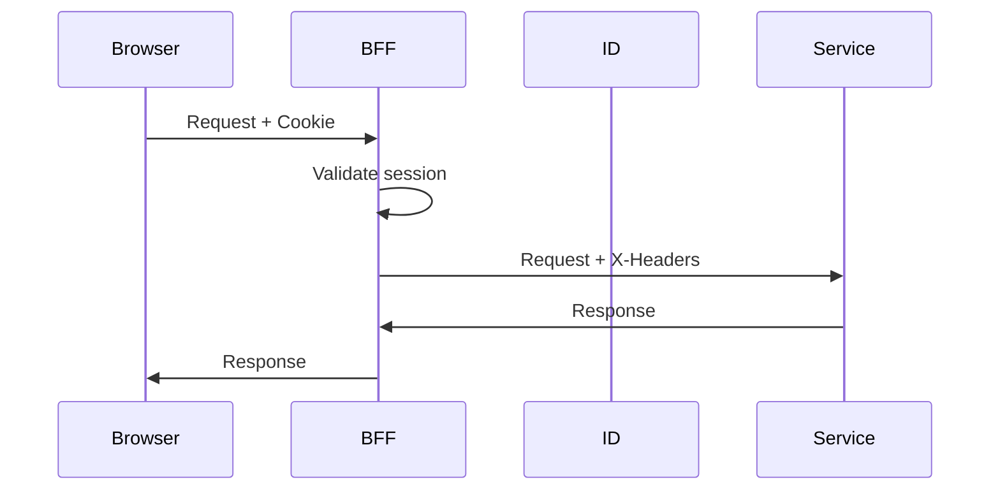

# Архитектурные принципы

Эти принципы были зафиксированы в **v0.1** как "конституция" проекта.

## 1. Нет Self-Signup

```
Пользователи НЕ могут сами регистрироваться.
Только: Application → Approve администратором → Activation link
```

### Процесс регистрации
1. Пользователь подаёт заявку (`POST /applications`)
2. Администратор одобряет (`POST /applications/{id}/approve`)
3. Система создаёт User + TenantMembership
4. Пользователь получает одноразовый activation link
5. После активации — вход через magic-link

### Почему так?
- Контроль доступа к закрытому сообществу
- Возможность проверки участников
- Защита от спама и ботов

## 2. UpdSpaceID — единственная идентичность

```
Вся аутентификация только через id.updspace.com
```

### Ответственности UpdSpaceID
- Хранение учётных записей пользователей
- Аутентификация (magic-link, MFA, passkeys)
- OIDC Provider для BFF
- Master rules (suspended, banned, system_admin)
- Tenant membership

### OAuth Providers НЕ создают аккаунт
```
GitHub/Discord/Steam OAuth login возможен ТОЛЬКО если:
ExternalIdentity уже привязана к существующему user_id
```

## 3. Multi-Tenancy

```
Tenant определяется по subdomain: aef.updspace.com → tenant_slug=aef
```

### Изоляция данных
- Все таблицы (кроме глобальных ID) содержат `tenant_id`
- Каждый запрос фильтруется по `tenant_id`
- Невозможно получить данные чужого tenant

### Передача контекста
```
BFF добавляет во внутренние запросы:
- X-Tenant-Id: UUID
- X-Tenant-Slug: string
```

## 4. BFF Обязателен

```
Фронтенд НЕ хранит токены.
Сессия в HttpOnly cookie на .updspace.com
```

### Архитектура



### Что делает BFF
1. Хранит сессию (Redis + Postgres fallback)
2. Резолвит tenant по hostname
3. Проксирует запросы в микросервисы
4. Добавляет контекст (user_id, tenant_id, master_flags)
5. HMAC-подпись для service-to-service

## 5. Централизованная авторизация

```
Master rules в UpdSpaceID имеют высший приоритет.
Остальные права — через Access Control Service.
```

### Иерархия приоритетов
1. **UpdSpaceID Master Rules** (deny/allow верхнего приоритета)
   - `suspended` / `banned` → deny all
   - `system_admin` → allow all (с аудитом)
   - `membership_status` → проверка активности в tenant

2. **Access PolicyOverride** (explicit deny/allow)
   - Персональные запреты/разрешения

3. **Access RBAC** (roles + permissions)
   - Role bindings в scope (TENANT/COMMUNITY/TEAM/SERVICE)
   - Вычисление effective permissions

### Visibility
```python
class Visibility:
    PUBLIC = "public"      # Все активные участники tenant
    COMMUNITY = "community" # Только члены сообщества
    TEAM = "team"          # Только члены команды
    PRIVATE = "private"    # Только создатель + admins
```

## 6. Python-First, но API-Agnostic

```
Все сервисы Python (FastAPI/Django Ninja).
Контракты позволяют переписать на Go/Rust без изменения API.
```

### Принципы контрактов
- OpenAPI-first документация
- Чёткие схемы запросов/ответов
- Stateless сервисы (состояние в DB/Redis)
- Идемпотентность где возможно

## 7. Модульность

```
Каждый сервис — отдельный bounded context.
Минимальные зависимости между сервисами.
```

### Модули платформы
| Модуль | Сервис | Описание |
|--------|--------|----------|
| Identity | UpdSpaceID | Аутентификация, SSO |
| Authorization | Access | RBAC, permissions |
| Portal | Portal Core | Communities, teams, posts |
| Voting | Voting | Голосования |
| Events | Events | Календарь, RSVP |
| Activity | Activity | Feed, connectors |

## 8. Graceful Degradation

```
Система должна работать при частичной недоступности сервисов.
```

### Стратегии
- **Circuit breaker**: Отключение зависимости при ошибках
- **Fallback**: Показ кэшированных данных
- **Retry с backoff**: Автоматические повторные попытки
- **User-friendly errors**: Понятные сообщения с request_id

### Frontend поведение
- Показ ServiceUnavailablePage при 5xx
- Offline banner при потере сети
- Auto-retry с exponential backoff
