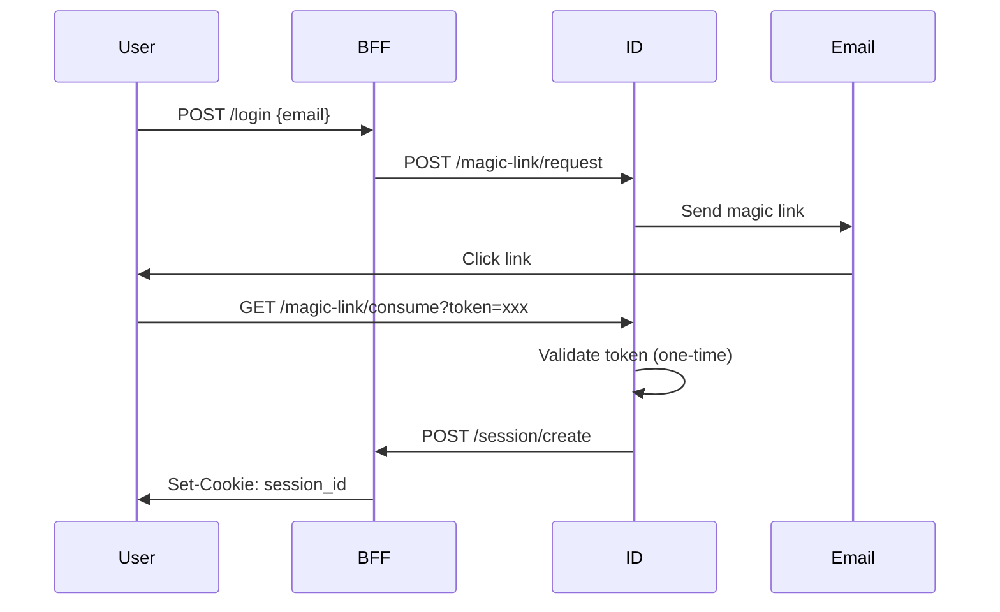
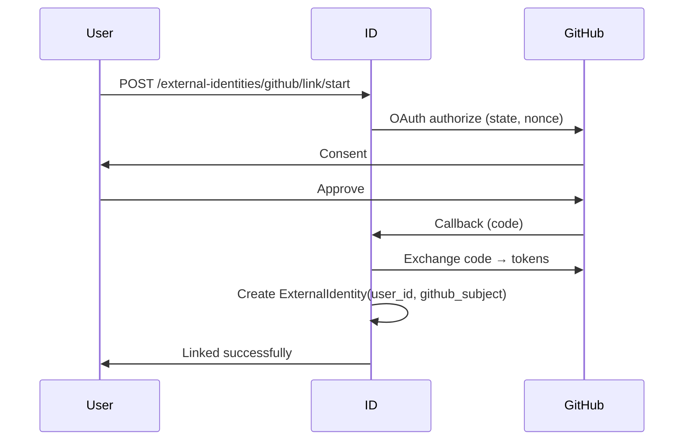

# Безопасность

## Модель угроз

### Аутентификация

| Угроза | Митигация |
|--------|-----------|
| Password brute force | Magic-link (без паролей) + MFA |
| Session hijacking | HttpOnly + Secure + SameSite cookies |
| Token theft | Токены не хранятся в браузере (BFF pattern) |
| OAuth token leak | Server-side OAuth flow через BFF |
| Replay attack | Nonce/state в OAuth, одноразовые tokens |

### Авторизация

| Угроза | Митигация |
|--------|-----------|
| Privilege escalation | Централизованная проверка в Access Service |
| Bypass RBAC | Master flags в UpdSpaceID (suspended → deny all) |
| Stale permissions | Real-time check при каждом запросе |

### Multi-Tenancy

| Угроза | Митигация |
|--------|-----------|
| Cross-tenant data | tenant_id в каждой таблице + фильтрация |
| Subdomain spoofing | Валидация tenant по DNS records |
| Cache pollution | Tenant-scoped cache keys |

## Аутентификация

### Magic Link Flow



### MFA (Multi-Factor Authentication)

Поддерживаемые методы:
- **TOTP** (Authenticator apps)
- **Recovery Codes** (backup)
- **Passkeys/WebAuthn** (biometric)

### OAuth Linking (НЕ создание аккаунта!)



## Авторизация (RBAC)

### Иерархия приоритетов

```
1. Master Rules (UpdSpaceID)
   ├── suspended=true  → DENY ALL
   ├── banned=true     → DENY ALL
   └── system_admin=true → ALLOW ALL (with audit)

2. Policy Overrides (Access Service)
   ├── PolicyOverride(action=DENY, permission=X)  → DENY X
   └── PolicyOverride(action=ALLOW, permission=X) → ALLOW X

3. RBAC (Access Service)
   └── RoleBinding → Role → RolePermission → Permission
```

### Permission Check

```python
# Access Service: POST /check
{
    "tenant_id": "uuid",
    "user_id": "uuid",
    "action": "voting.vote.cast",
    "scope": {"type": "COMMUNITY", "id": "uuid"},
    "resource_visibility": "community",
    "resource_owner_id": null
}

# Response
{
    "allowed": true,
    "reason_code": "RBAC_ALLOW",
    "effective_roles": ["member", "voter"]
}
```

## Session Management

### Cookie настройки

```python
SESSION_COOKIE_NAME = "updspace_session"
SESSION_COOKIE_HTTPONLY = True      # Нет доступа из JS
SESSION_COOKIE_SECURE = True        # Только HTTPS (prod)
SESSION_COOKIE_SAMESITE = "Lax"     # CSRF защита
SESSION_COOKIE_DOMAIN = ".updspace.com"  # Shared across subdomains
```

### Session Storage

```python
class Session:
    session_id: UUID       # В cookie
    user_id: UUID
    tenant_id: UUID
    master_flags: dict     # Из UpdSpaceID
    created_at: datetime
    expires_at: datetime   # TTL 14 дней
```

Хранение:
1. **Redis** (primary) — быстрый доступ
2. **PostgreSQL** (fallback) — при отказе Redis

## Service-to-Service

### HMAC Подпись

```python
# BFF подписывает запрос
def sign_request(method, path, body, request_id, timestamp, secret):
    body_hash = hashlib.sha256(body.encode()).hexdigest()
    message = f"{method}\n{path}\n{body_hash}\n{request_id}\n{timestamp}"
    signature = hmac.new(
        secret.encode(),
        message.encode(),
        hashlib.sha256
    ).hexdigest()
    return signature

# Headers
X-Request-Id: uuid
X-Updspace-Timestamp: 1705234567
X-Updspace-Signature: abc123...
```

### Валидация в сервисе

```python
def validate_signature(request):
    timestamp = int(request.headers["X-Updspace-Timestamp"])
    
    # Проверка времени (защита от replay)
    if abs(time.time() - timestamp) > 300:  # 5 минут
        raise SecurityError("Timestamp too old")
    
    expected = sign_request(...)
    actual = request.headers["X-Updspace-Signature"]
    
    if not hmac.compare_digest(expected, actual):
        raise SecurityError("Invalid signature")
```

## Rate Limiting

### Лимиты по умолчанию

| Endpoint | Limit |
|----------|-------|
| `/auth/magic-link/request` | 5/hour per email |
| `/auth/login` | 10/minute per IP |
| `/voting/votes` | 100/minute per user |
| Session operations | 1000/minute per session |

### Реализация

```python
from django_ratelimit.decorators import ratelimit

@ratelimit(key='ip', rate='10/m', block=True)
def login(request):
    ...
```

## CSRF Protection

### Стратегия

Для API с cookie-based auth используется:
1. **SameSite=Lax** — базовая защита
2. **Double-submit cookie** (опционально)
3. **Origin header validation**

```python
def validate_origin(request):
    origin = request.headers.get("Origin")
    allowed = [
        "https://aef.updspace.com",
        "https://id.updspace.com",
    ]
    if origin not in allowed:
        raise CSRFError("Invalid origin")
```

## Audit Logging

### Что логируется

```python
class AuditLog:
    id: UUID
    actor_user_id: Optional[UUID]
    action: str              # login, vote.cast, role.assign
    target_type: str         # user, poll, role
    target_id: Optional[UUID]
    tenant_id: Optional[UUID]
    ip_address: str
    user_agent: str
    meta: dict               # Дополнительный контекст
    created_at: datetime
```

### Обязательный аудит

- Все действия `system_admin`
- Все `PolicyOverride` применения
- Login/logout события
- Role assignments
- Failed access attempts
