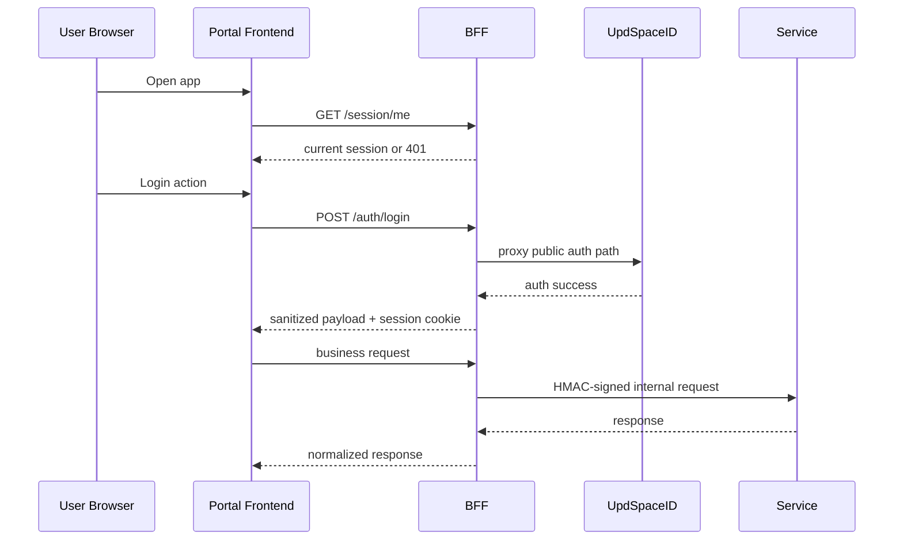

# Security Model

Этот раздел описывает security baseline, который уже отражен в структуре платформы.

## Browser authentication

Browser работает через BFF session cookie. Основные свойства модели:

- `HttpOnly` cookie вместо browser-visible bearer token;
- CSRF защита для state-changing запросов;
- logout и session revocation проходят через BFF;
- frontend хранит session state как результат `session/me`, а не как секрет.

## Internal service authentication

Доменные сервисы не полагаются на browser cookie. Вместо этого BFF или другой доверенный сервис передает:

- HMAC подпись запроса;
- `X-Request-Id`;
- `X-Tenant-Id`;
- `X-Tenant-Slug`;
- `X-User-Id`;
- `X-Master-Flags`.

Это дает четкую границу доверия: browser не должен уметь формировать доверенный internal context.

## Auth chain

```mermaid
sequenceDiagram
    participant U as User Browser
    participant F as Portal Frontend
    participant B as BFF
    participant I as UpdSpaceID
    participant S as Service

    U->>F: Open app
    F->>B: GET /session/me
    B-->>F: current session or 401
    U->>F: Login action
    F->>B: POST /auth/login
    B->>I: proxy public auth path
    I-->>B: auth success
    B-->>F: sanitized payload + session cookie
    F->>B: business request
    B->>S: HMAC-signed internal request
    S-->>B: response
    B-->>F: normalized response
```

## Permission model

Capability decision живет в Access. Сервисы используют:

- `has_permission(...)`;
- service client wrappers к `/access/check`;
- дополнительные domain ownership checks там, где одного capability недостаточно.

## Security responsibilities by layer

| Layer | Responsibility |
| --- | --- |
| Frontend | не хранить секреты, корректно отправлять cookie и CSRF |
| BFF | session lifecycle, auth proxying, tenant resolution, request normalization |
| Access | effective permission evaluation |
| Domain services | tenant filtering, permission enforcement, ownership rules |
| Infra | TLS termination, network segmentation, secrets delivery, backups |

## Security notes for contributors

- не добавляйте browser-visible auth token path;
- не делайте сервисные endpoints, которые ждут `request.user` от Django session, если они находятся за BFF/HMAC;
- не внедряйте bypass для permission checks без явной причины и документации;
- не передавайте внутренние секреты в response payload.
