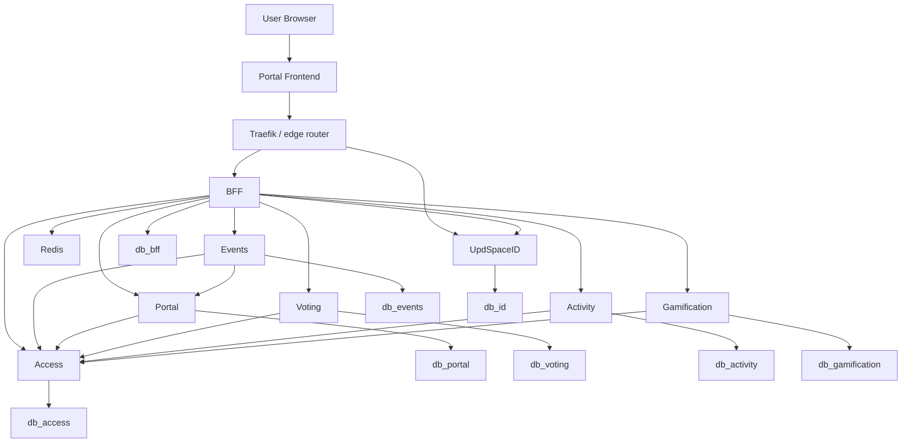
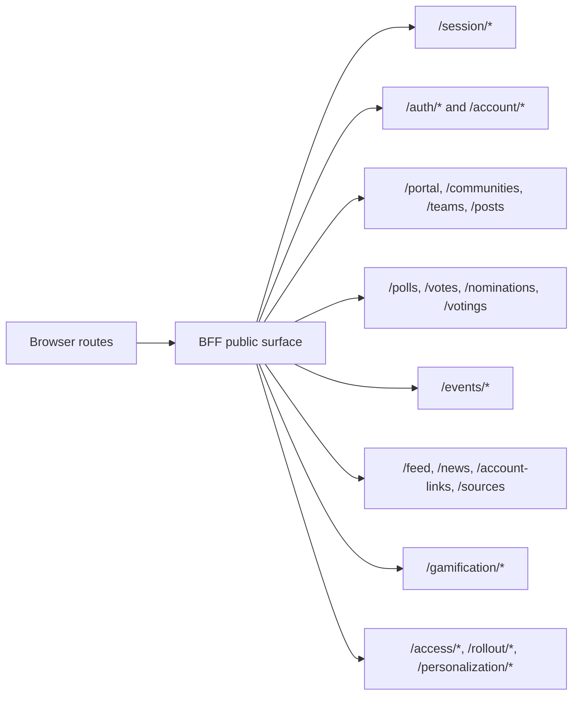
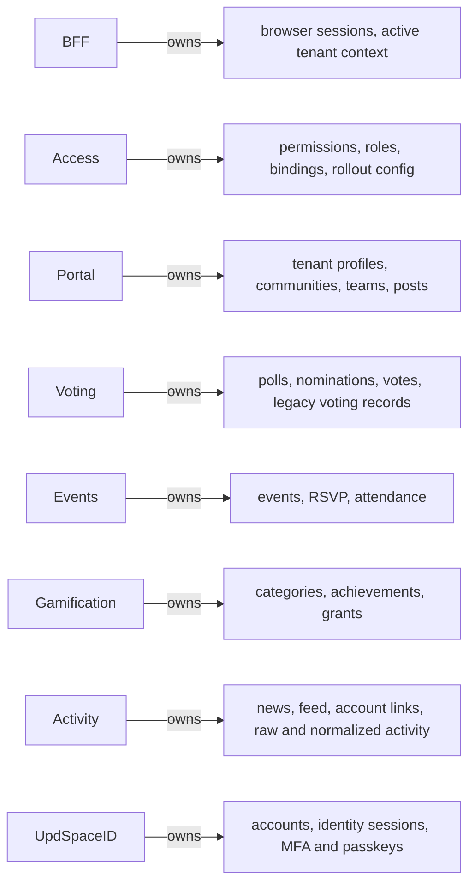
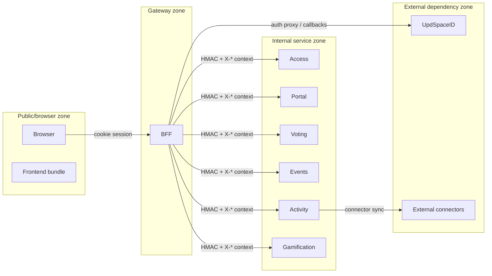
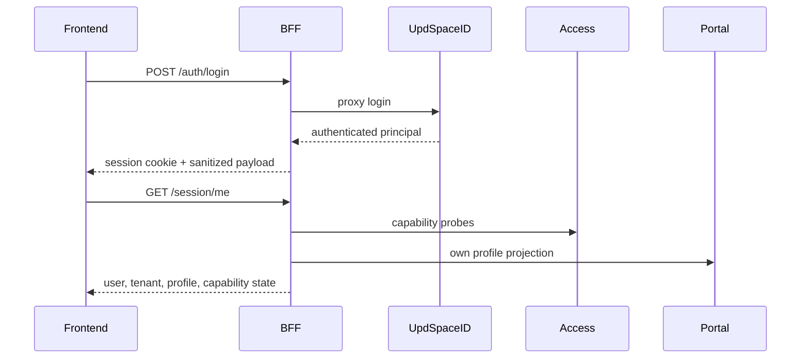
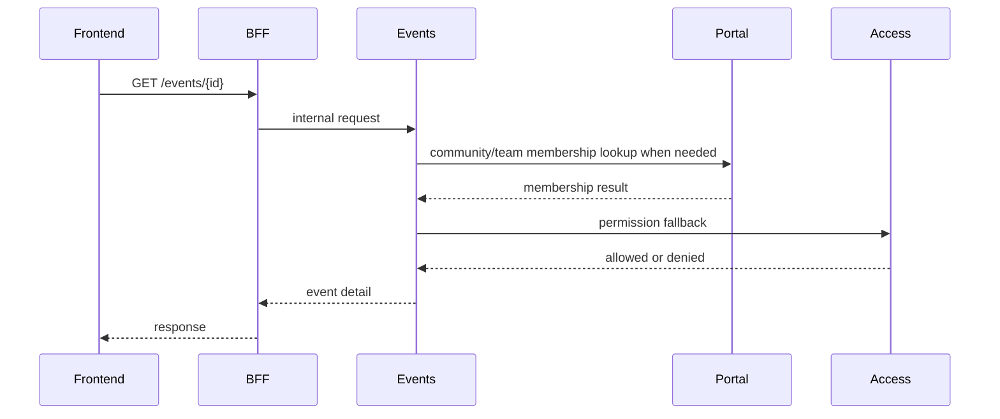
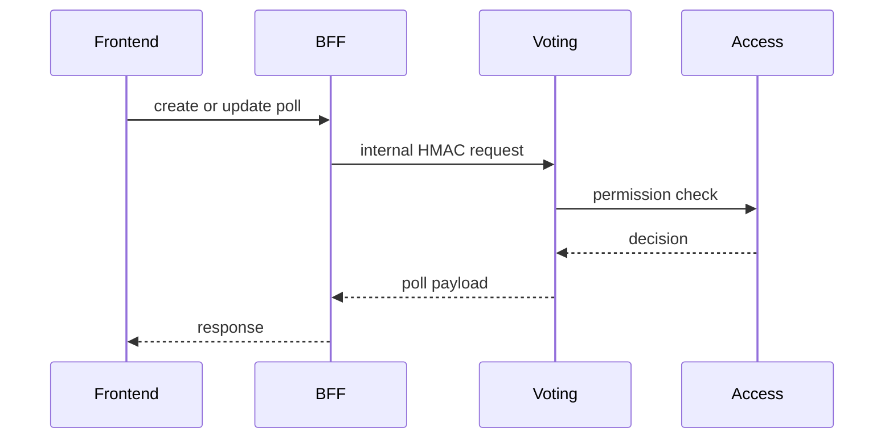

# Service Mesh and Runtime Graph

Этот раздел нужен для чтения платформы как распределенной системы. Здесь зафиксировано, кто с кем разговаривает, через какие trust boundaries и где живет authoritative state.

## 1. Full runtime graph

## 2. Browser route ownership graph

## 3. State ownership graph

## 4. Request trust zones

## 5. Cross-service business flows

### Login and session bootstrap

### Event visibility path

### Poll management path

## 6. Design implications

- BFF остается главным integration seam для browser-visible features.
- Access является общей policy plane, но не доменным owner для контента.
- Portal, Events и Voting используют совместно понятие tenant/community/team scope, поэтому их контракты нужно менять синхронно.
- Activity наиболее интеграционно насыщен: он одновременно касается внешних connectors, feed UX и privacy-sensitive data handling.
