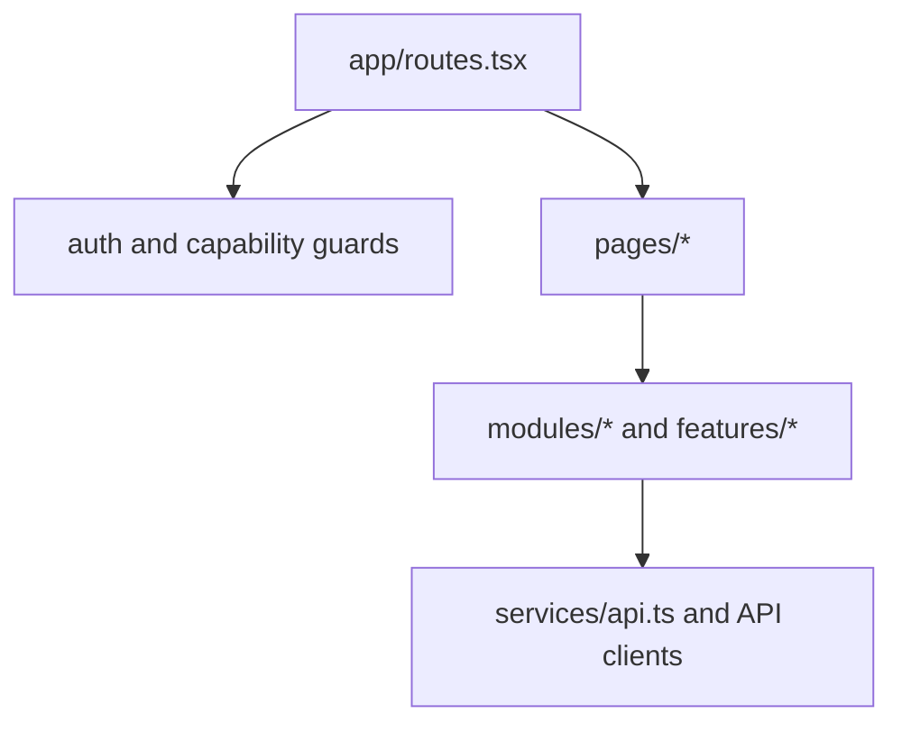

# Frontend Overview

В текущем репозитории есть один frontend application: `web/portal-frontend`.

## Stack

- React 19
- TypeScript
- Vite
- React Router
- test stack вокруг Vitest и Playwright

## Architectural role

Frontend не является thin template layer. Он берет на себя:

- route orchestration;
- capability-aware navigation;
- tenant selection UX;
- composition of domain modules;
- browser-side session bootstrap through BFF.

## High-level app map

## Important rule

Portal frontend больше не строится вокруг browser-stored bearer tokens. Каноническая auth model - cookie session через BFF.
