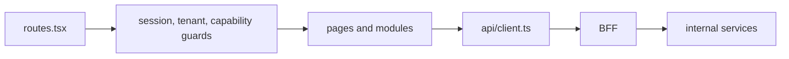

# Portal Frontend

## Main structure

| Area | Purpose |
| --- | --- |
| `src/app` | router, guards, providers, layout |
| `src/modules` | larger domain modules like events, feed, gamification, portal, tenantAdmin, voting |
| `src/features` | narrower feature-level logic |
| `src/pages` | route-level entrypoints |
| `src/services` | session, account, auth and shared API helpers |
| `src/api` | low-level request client |

## Route model

Текущая маршрутизация поддерживает:

- public routes вроде landing, login, invite;
- tenant chooser;
- path-based tenant routes `/t/:tenantSlug/*`;
- legacy redirects из старых путей в новый tenant-aware flow.

## Frontend to backend graph

## How frontend talks to backend

- shared request client in `src/api/client.ts`;
- high-level auth/session helpers in `src/services/api.ts`;
- feature-specific API modules внутри `src/modules/*` и `src/features/*`;
- все вызовы идут в BFF relative paths.

## Guards

Ключевые guards:

- `RequireSession`
- `TenantGate`
- `RequireCapability`
- `AuthLoadingGuard`

Они отражают реальную архитектуру: сначала нужен session context, затем tenant context, затем capability decision.
