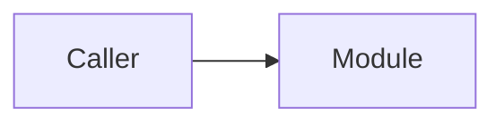

# Documentation Playbook

Этот раздел задает строгий формат сопровождения документации людьми и AI-агентами.

## Source of truth order

При обновлении документации используйте такой порядок доверия:

1. текущий код и tests;
2. compose topology и runtime settings;
3. актуальные frontend routes и API clients;
4. только потом старые ADR, ТЗ и заметки.

## Required page shape

Каждая новая сервисная или архитектурная страница должна по возможности отвечать на пять вопросов:

1. за что отвечает модуль;
2. какие у него входные и выходные контракты;
3. какие модели или state он хранит;
4. от каких сервисов или библиотек он зависит;
5. какие operational или security ограничения нельзя забывать.

## Recommended template

```md
---
title: Module Name
---

# Module Name

Короткий абзац о назначении.

## Responsibilities

- ...

## Main modules or models

| Item | Purpose |
| --- | --- |
| ... | ... |

## Request flow



## Operational notes

- ...
```

## Documentation update checklist

- сервис добавил новый endpoint;
- изменилась trust boundary;
- поменялась tenant logic;
- обновился auth/session flow;
- добавились retention, audit или DSAR изменения;
- frontend route или capability guard перестал соответствовать backend reality.

## Style rules

- пишем от фактической реализации, а не от желаемой;
- явно помечаем external dependencies и legacy зоны;
- diagrams держим простыми и полезными;
- не дублируем целиком OpenAPI, если это не приносит пользы.
