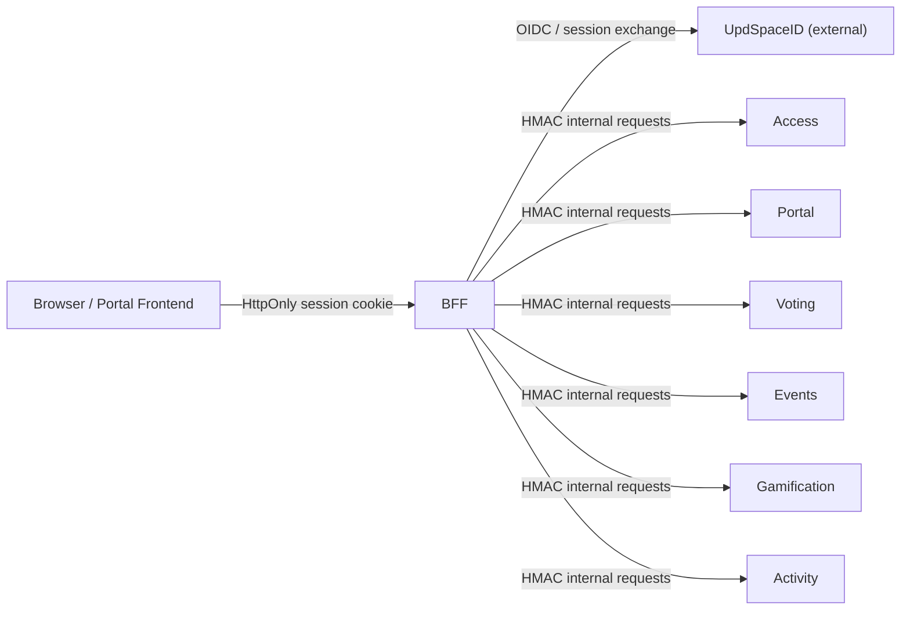

# UpdSpace Platform

Эта документация описывает **текущее состояние репозитория**, а не изначальное ТЗ. Ее задача простая: дать инженеру, техлиду, оператору или AI-агенту рабочую карту того, как устроена платформа, какие модули в ней живут, по каким контрактам они общаются и какие политики уже считаются обязательными.

## Что находится в этом репозитории

UpdSpace Portal сейчас состоит из:

- `web/portal-frontend` - единственный локальный frontend в репозитории.
- `services/bff` - gateway между браузером и внутренними сервисами.
- `services/access` - RBAC, rollout и personalization.
- `services/portal` - профили, communities, teams, posts.
- `services/voting` - гибридный слой из legacy voting API и tenant-aware poll API.
- `services/events` - календарь, RSVP, attendance, ICS.
- `services/gamification` - achievements, grants, categories.
- `services/activity` - feed, news, connectors, account links.
- внешний `UpdSpaceID` - identity provider, который в dev topology запускается как внешний контейнерный образ.

## Как читать этот набор документов

Если нужно быстро войти в проект, порядок такой:

1. [Architecture Overview](./architecture/overview.md)
2. [Security Model](./architecture/security.md)
3. [Services Overview](./services/overview.md)
4. нужный сервисный раздел
5. [Portal Frontend](./frontend/portal.md)
6. [Documentation Playbook](./guides/documentation-playbook.md)

## Ключевые правила платформы

- Browser не хранит auth tokens в `localStorage` или `sessionStorage`.
- Все пользовательские запросы идут через BFF и опираются на cookie session.
- Межсервисные запросы защищены HMAC-контекстом и `X-*` internal headers.
- Tenant isolation проходит через `tenant_id`, `tenant_slug`, scope-aware permissions и фильтрацию на уровне моделей и API.
- Любой новый доменный модуль должен иметь внятную историю по authorization, observability, DSAR и retention.

## Системный контекст

## В чем обновленная цель документации

Этот набор должен отвечать на четыре вопроса без чтения исходников:

- какой сервис владеет определенной бизнес-областью;
- какой входной контракт считается каноническим;
- какие зависимости и trust boundaries участвуют в запросе;
- какие ограничения нельзя нарушать при доработках.

## Scope и честные границы

Документация не пытается притворяться полной product-spec. Она фиксирует:

- реальную модульную архитектуру;
- сервисные обязанности;
- текущие потоки данных и auth;
- production baseline по эксплуатации и privacy.

Она не заменяет:

- UX/product requirements;
- legal opinion локального юриста;
- runbook конкретного окружения, если он живет вне репозитория.
