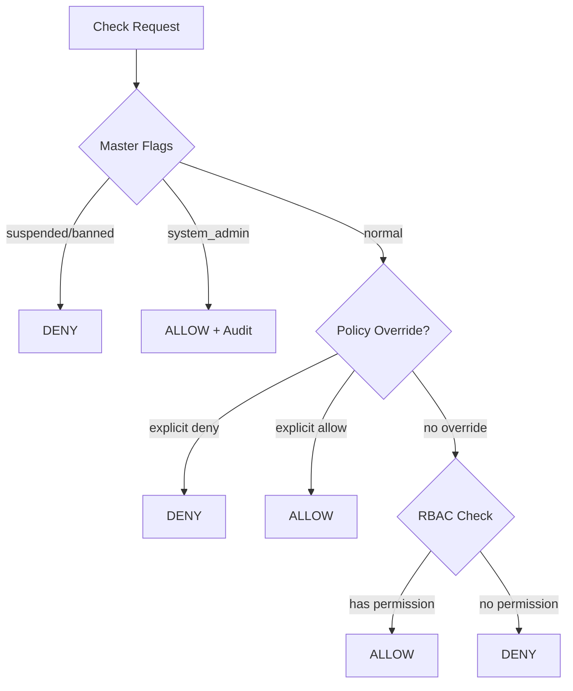

# Access Control Service

**Access Control** — централизованный сервис авторизации (RBAC).

- **Path**: `services/access`
- **Port**: 8002

## Ключевые функции

1. **Permission Check** — проверка доступа к действию
2. **Role Management** — управление ролями
3. **Role Bindings** — назначение ролей пользователям
4. **Policy Overrides** — явные разрешения/запреты

## Статус реализации

| Функционал | Статус |
|------------|--------|
| Permission check | ✅ Done |
| Master flags integration | ✅ Done |
| RBAC (roles + bindings) | ✅ Done |
| Policy overrides | ✅ Done |
| MVP permissions list | ✅ Done |

## Архитектура проверки



## Приоритеты

1. **Master Flags** (высший приоритет)
   - `suspended=true` → DENY ALL
   - `banned=true` → DENY ALL
   - `system_admin=true` → ALLOW ALL (с аудитом)

2. **Policy Overrides**
   - Явный `DENY` для пользователя → deny
   - Явный `ALLOW` для пользователя → allow

3. **RBAC**
   - User → RoleBinding → Role → RolePermission → Permission

## Scopes

```python
class ScopeType(str, Enum):
    GLOBAL = "GLOBAL"       # Платформенный уровень
    TENANT = "TENANT"       # Уровень tenant
    COMMUNITY = "COMMUNITY" # Сообщество
    TEAM = "TEAM"           # Команда
    SERVICE = "SERVICE"     # Сервис-специфичный
```

Права проверяются в контексте scope:

```python
check(
    action="voting.vote.cast",
    scope={"type": "COMMUNITY", "id": "community-uuid"}
)
```

## API

### Check Permission

```http
POST /api/v1/check
Content-Type: application/json

{
  "tenant_id": "uuid",
  "user_id": "uuid",
  "action": "voting.vote.cast",
  "scope": {
    "type": "COMMUNITY",
    "id": "community-uuid"
  },
  "resource_visibility": "community",
  "resource_owner_id": null
}
```

**Response:**
```json
{
  "allowed": true,
  "reason_code": "RBAC_ALLOW",
  "effective_roles": ["member", "voter"]
}
```

### Policy Overrides

Policy overrides allow system administrators to force `allow`/`deny` decisions for specific permissions,
either globally or scoped to a tenant.

```http
POST /api/v1/access/policy-overrides
Content-Type: application/json

{
  "tenant_id": "uuid",
  "user_id": "uuid",
  "action": "deny",
  "permission_key": "voting.vote.cast",  # optional
  "reason": "suspended",
  "expires_at": "2026-01-15T00:00:00Z"
}
```

```http
GET /api/v1/access/policy-overrides?user_id=uuid&active=true
```

```http
DELETE /api/v1/access/policy-overrides/{id}
```

All policy override endpoints require the internal HMAC headers (`X-Updspace-Signature`, etc.) and a
system-admin master flag. Overrides are tenant-scoped (`X-Tenant-Id` must match `tenant_id` in the payload).

### Reason Codes

| Code | Description |
|------|-------------|
| `MASTER_DENY` | Suspended/banned |
| `SYSTEM_ADMIN` | System admin bypass |
| `POLICY_DENY` | Explicit policy deny |
| `POLICY_ALLOW` | Explicit policy allow |
| `RBAC_ALLOW` | Role has permission |
| `RBAC_DENY` | No role with permission |

## Интеграция в сервисы

```python
# В каждом сервисе
from core.access import check_permission

async def create_post(request, data: PostCreate):
    allowed = await check_permission(
        tenant_id=request.tenant_id,
        user_id=request.user_id,
        action="portal.posts.create",
        scope={"type": "COMMUNITY", "id": data.community_id},
        master_flags=request.master_flags,
    )
    
    if not allowed:
        raise PermissionDenied()
    
    # Create post...
```
