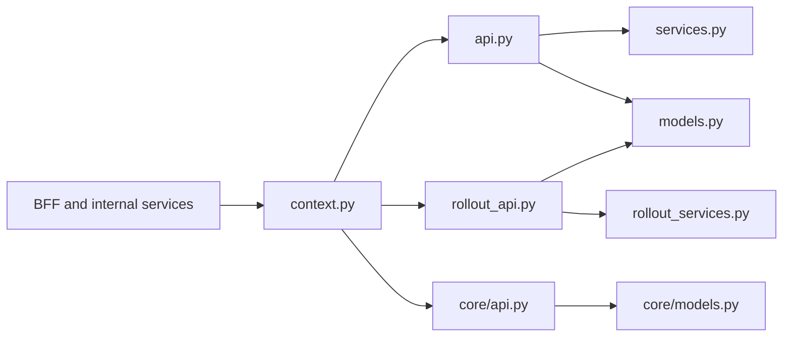
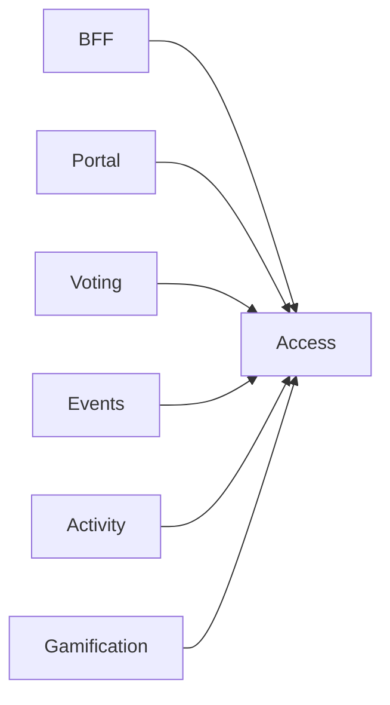

# Access Overview

Access - это не только "таблица прав". В текущем репозитории сервис объединяет три поддомена:

- RBAC и policy overrides;
- rollout management;
- personalization/homepage modals.

## Main API surfaces

| Prefix | Purpose |
| --- | --- |
| `/access/*` | permission checks, roles, bindings, overrides, tenant admin APIs |
| `/rollout/*` | feature flags, experiments, kill switches |
| `/personalization/*` | homepage modals and lightweight personalization config |

## Main models

| Model | Purpose |
| --- | --- |
| `Permission` | atomic capability key |
| `Role` | named bundle of permissions |
| `RolePermission` | mapping between roles and permissions |
| `RoleBinding` | grants role to user in scope |
| `PolicyOverride` | explicit allow/deny exception |
| `TenantAdminAuditEvent` | audit trail for admin changes |
| `FeatureFlag` / `Experiment` / `KillSwitch` | rollout control |
| `RolloutAuditLog` | rollout change history |
| `HomePageModal` | personalization content shown in UI |

## Service position

Access почти не владеет пользовательским контентом, но влияет на поведение почти всех сервисов, потому что authorization decisions сходятся сюда.

## Internal module graph

```mermaid
flowchart LR
    Callers["BFF and internal services"] --> Context["context.py"]
    Context --> RBAC["api.py"]
    Context --> Rollout["rollout_api.py"]
    Context --> Personalization["core/api.py"]
    RBAC --> Services["services.py"]
    RBAC --> Models["models.py"]
    Rollout --> RolloutServices["rollout_services.py"]
    Rollout --> Models
    Personalization --> CoreModels["core/models.py"]
```

## Service mesh position

```mermaid
flowchart LR
    BFF --> Access["Access"]
    Portal --> Access
    Voting --> Access
    Events --> Access
    Activity --> Access
    Gamification --> Access
```

## Design consequence

Если capability model или scope semantics меняются, это one-to-many change:

- frontend guards;
- BFF capability probes;
- доменные сервисы;
- tenant admin UI.
