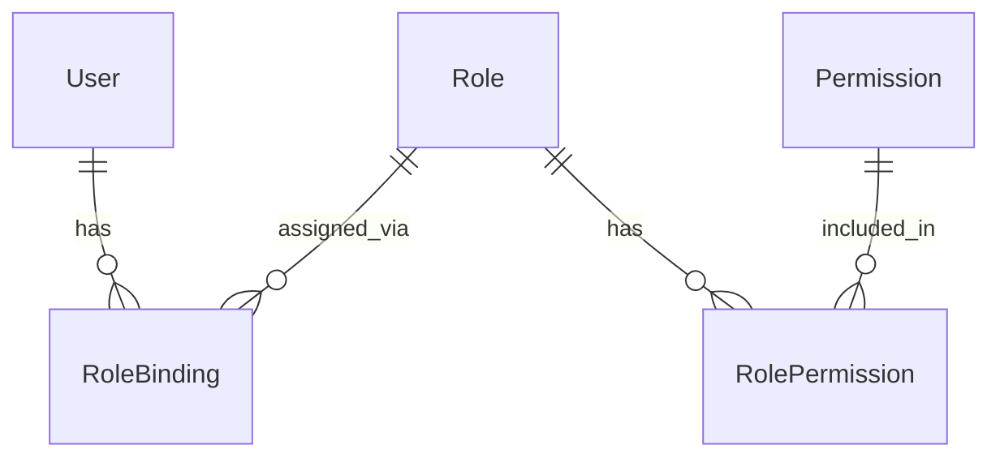

# RBAC (Role-Based Access Control)

## Модель данных



### Permission

```python
class Permission(models.Model):
    key = models.CharField(max_length=100, primary_key=True)
    # Format: {service}.{resource}.{action}
    # Example: voting.vote.cast
    
    description = models.TextField()
    service = models.CharField(max_length=50)
    # Values: PORTAL, VOTING, EVENTS, ACTIVITY
    
    class Meta:
        db_table = "permissions"
```

### Role

```python
class Role(models.Model):
    id = models.UUIDField(primary_key=True, default=uuid.uuid4)
    tenant_id = models.UUIDField(null=True)  # null = system template
    
    service = models.CharField(max_length=50)  # PORTAL, VOTING, etc.
    name = models.CharField(max_length=100)    # member, admin, moderator
    
    is_system_template = models.BooleanField(default=False)
    
    class Meta:
        db_table = "roles"
        unique_together = [["tenant_id", "service", "name"]]
```

### RolePermission

```python
class RolePermission(models.Model):
    role = models.ForeignKey(Role, on_delete=models.CASCADE)
    permission = models.ForeignKey(Permission, on_delete=models.CASCADE)
    
    class Meta:
        db_table = "role_permissions"
        unique_together = [["role", "permission"]]
```

### RoleBinding

```python
class RoleBinding(models.Model):
    id = models.UUIDField(primary_key=True, default=uuid.uuid4)
    
    tenant_id = models.UUIDField()
    user_id = models.UUIDField()
    role = models.ForeignKey(Role, on_delete=models.CASCADE)
    
    scope_type = models.CharField(max_length=20)
    # Values: GLOBAL, TENANT, COMMUNITY, TEAM, SERVICE
    
    scope_id = models.UUIDField(null=True)
    # null for GLOBAL/TENANT scope
    
    created_at = models.DateTimeField(auto_now_add=True)
    created_by = models.UUIDField(null=True)
    
    class Meta:
        db_table = "role_bindings"
```

## Алгоритм проверки

```python
def check_rbac(
    tenant_id: UUID,
    user_id: UUID,
    action: str,
    scope: dict,
) -> tuple[bool, list[str]]:
    """
    Returns: (allowed, effective_roles)
    """
    
    # 1. Get all role bindings for user in this tenant
    bindings = RoleBinding.objects.filter(
        tenant_id=tenant_id,
        user_id=user_id,
    )
    
    # 2. Filter by scope hierarchy
    applicable_bindings = []
    for binding in bindings:
        if is_scope_applicable(binding.scope_type, binding.scope_id, scope):
            applicable_bindings.append(binding)
    
    # 3. Collect permissions from all applicable roles
    role_ids = [b.role_id for b in applicable_bindings]
    permissions = RolePermission.objects.filter(
        role_id__in=role_ids
    ).values_list("permission_id", flat=True)
    
    # 4. Check if action is in permissions
    allowed = action in permissions
    
    effective_roles = [b.role.name for b in applicable_bindings]
    
    return allowed, effective_roles


def is_scope_applicable(binding_scope: str, binding_scope_id: UUID, target: dict) -> bool:
    """
    Check if binding scope covers target scope.
    
    GLOBAL > TENANT > COMMUNITY > TEAM
    """
    target_type = target["type"]
    target_id = target.get("id")
    
    # GLOBAL covers everything
    if binding_scope == "GLOBAL":
        return True
    
    # TENANT covers everything in tenant
    if binding_scope == "TENANT":
        return True
    
    # COMMUNITY covers community and its teams
    if binding_scope == "COMMUNITY":
        if target_type == "COMMUNITY" and binding_scope_id == target_id:
            return True
        if target_type == "TEAM":
            # Check if team belongs to this community
            return is_team_in_community(target_id, binding_scope_id)
    
    # TEAM covers only specific team
    if binding_scope == "TEAM":
        return target_type == "TEAM" and binding_scope_id == target_id
    
    return False
```

## Policy Override Management

System administrators can manage policy overrides through the Access API. Overrides are tenant-scoped and
are enforced before RBAC, so they can suspend or elevate users without changing roles.

Endpoints:

```http
POST /api/v1/access/policy-overrides
GET /api/v1/access/policy-overrides
DELETE /api/v1/access/policy-overrides/{override_id}
```

Each call requires `system_admin=true` in the master flags and the internal HMAC headers. The `X-Tenant-Id`
header must match the `tenant_id` in the override payload.

## System Roles

Предустановленные роли-шаблоны:

### Portal Roles

| Role | Permissions |
|------|-------------|
| `portal:member` | profile.read_self, profile.edit_self, communities.read, posts.read |
| `portal:moderator` | + posts.create, teams.manage |
| `portal:admin` | + communities.manage, applications.review, roles.write |

### Voting Roles

| Role | Permissions |
|------|-------------|
| `voting:voter` | poll.read, vote.cast, results.read |
| `voting:admin` | + votings.admin, nominations.admin |

### Events Roles

| Role | Permissions |
|------|-------------|
| `events:participant` | event.read, rsvp.set |
| `events:organizer` | + event.create, event.manage, attendance.mark |

## Назначение ролей

### Автоматическая базовая роль

Начиная с текущей реализации, Access автоматически добавляет роль `member`
в вычисление эффективных прав для каждого пользователя внутри tenant (по сервису),
даже без явного `RoleBinding`.

Порядок выбора:

1. Tenant-роль `member` (`tenant_id=<tenant>`) для нужного сервиса.
2. Если её нет, глобальный шаблон `member` (`tenant_id=null`, `is_system_template=true`).

Это даёт доступ «из коробки» для базовых сценариев (профиль, чтение, постинг, голосование, RSVP и т.д.),
а tenant-админ может переопределить базовые права через собственную tenant-роль `member`.

### API

```http
POST /api/v1/role-bindings
Authorization: Bearer {admin_token}
Content-Type: application/json

{
  "user_id": "uuid",
  "role_id": "uuid",
  "scope_type": "COMMUNITY",
  "scope_id": "community-uuid"
}
```

### Пример: сделать модератором сообщества

```python
RoleBinding.objects.create(
    tenant_id=tenant_id,
    user_id=user_id,
    role=Role.objects.get(name="portal:moderator"),
    scope_type="COMMUNITY",
    scope_id=community_id,
    created_by=admin_id,
)
```

## Visibility Check

Помимо RBAC, проверяется видимость ресурса:

```python
def check_visibility(
    user_id: UUID,
    resource_visibility: str,
    resource_owner_id: UUID,
    scope: dict,
) -> bool:
    if resource_visibility == "public":
        return True
    
    if resource_visibility == "private":
        return user_id == resource_owner_id
    
    if resource_visibility == "community":
        return is_community_member(user_id, scope["id"])
    
    if resource_visibility == "team":
        return is_team_member(user_id, scope["id"])
    
    return False
```

## Кэширование

Для производительности роли кэшируются:

```python
def get_user_roles(tenant_id: UUID, user_id: UUID) -> List[RoleBinding]:
    cache_key = f"roles:{tenant_id}:{user_id}"
    
    cached = cache.get(cache_key)
    if cached:
        return cached
    
    roles = list(RoleBinding.objects.filter(
        tenant_id=tenant_id,
        user_id=user_id,
    ).select_related("role"))
    
    cache.set(cache_key, roles, ttl=300)  # 5 minutes
    return roles
```

### Инвалидация

При изменении ролей:

```python
def on_role_change(tenant_id: UUID, user_id: UUID):
    cache_key = f"roles:{tenant_id}:{user_id}"
    cache.delete(cache_key)
```
