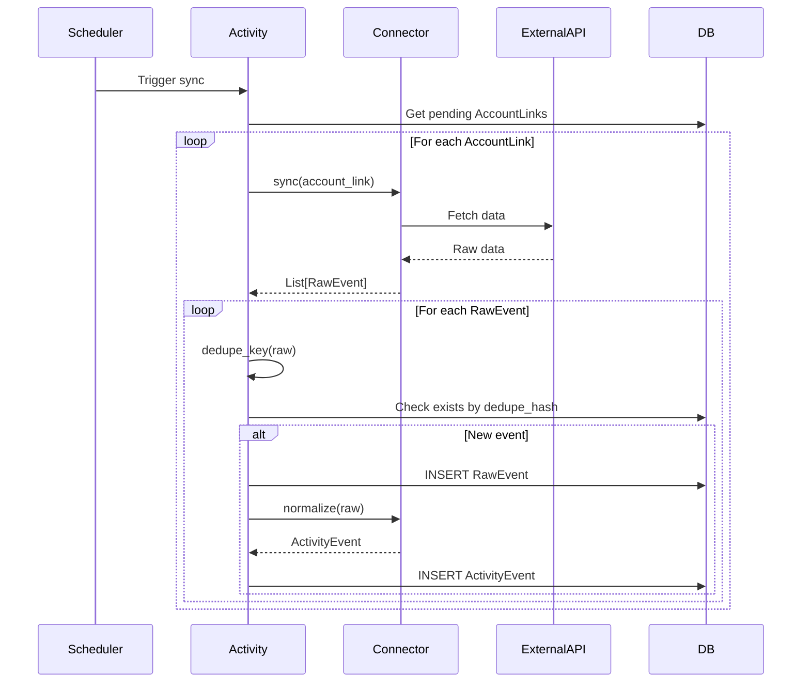

# Connectors

Коннекторы — модули для интеграции с внешними источниками данных.

## Статус коннекторов

| Connector | Status | Capabilities | API |
|-----------|--------|--------------|-----|
| Steam | ✅ MVP | sync, achievements, playtime | Steam Web API |
| Minecraft | ✅ MVP | webhook only | Custom webhook |
| Discord | 🔜 Planned | OAuth, presence | Discord API |

## Интерфейс коннектора

```python
from typing import Protocol, List, Any
from dataclasses import dataclass


@dataclass
class ConnectorCapabilities:
    can_sync: bool          # Может пулить данные
    can_webhook: bool       # Может принимать webhook
    requires_auth: bool     # Требует авторизацию пользователя
    rate_limits: dict       # Лимиты API


@dataclass
class RateLimits:
    requests_per_minute: int
    requests_per_day: int


@dataclass
class RetryPolicy:
    max_attempts: int
    backoff_seconds: float


class Connector(Protocol):
    def describe(self) -> ConnectorCapabilities:
        """Описание возможностей коннектора"""
        ...
    
    def dedupe_key(self, raw: dict) -> str:
        """Ключ дедупликации для raw event"""
        ...
    
    async def sync(self, account_link: Any) -> List[dict]:
        """Синхронизация: получить raw events от источника"""
        ...
    
    def normalize(self, raw: dict, account_link: Any) -> Any:
        """Преобразовать raw event в ActivityEvent"""
        ...
```

## Реализованные коннекторы

### SteamConnector

**Статус**: ✅ MVP  
**Файл**: `services/activity/src/activity/connectors/steam.py`

Полноценная интеграция со Steam Web API.

#### Возможности

- Получение профиля игрока
- Список всех игр
- Недавно сыгранные игры
- Достижения по играм

#### Реализация

```python
class SteamApiClient:
    """HTTP клиент для Steam Web API."""
    
    BASE_URL = "https://api.steampowered.com"
    
    def __init__(self, api_key: str):
        self.api_key = api_key
        self._client = httpx.AsyncClient(timeout=30.0)
    
    async def get_player_summary(self, steam_id: str) -> dict | None:
        """Получить профиль игрока."""
        url = f"{self.BASE_URL}/ISteamUser/GetPlayerSummaries/v2/"
        params = {"key": self.api_key, "steamids": steam_id}
        response = await self._client.get(url, params=params)
        response.raise_for_status()
        data = response.json()
        players = data.get("response", {}).get("players", [])
        return players[0] if players else None
    
    async def get_owned_games(self, steam_id: str) -> list[dict]:
        """Получить все игры пользователя."""
        url = f"{self.BASE_URL}/IPlayerService/GetOwnedGames/v1/"
        params = {
            "key": self.api_key,
            "steamid": steam_id,
            "include_appinfo": 1,
            "include_played_free_games": 1,
        }
        response = await self._client.get(url, params=params)
        response.raise_for_status()
        return response.json().get("response", {}).get("games", [])
    
    async def get_recent_games(self, steam_id: str, count: int = 10) -> list[dict]:
        """Получить недавно сыгранные игры."""
        url = f"{self.BASE_URL}/IPlayerService/GetRecentlyPlayedGames/v1/"
        params = {"key": self.api_key, "steamid": steam_id, "count": count}
        response = await self._client.get(url, params=params)
        response.raise_for_status()
        return response.json().get("response", {}).get("games", [])
    
    async def get_achievements(self, steam_id: str, app_id: int) -> list[dict]:
        """Получить достижения игрока в игре."""
        url = f"{self.BASE_URL}/ISteamUserStats/GetPlayerAchievements/v1/"
        params = {"key": self.api_key, "steamid": steam_id, "appid": app_id}
        try:
            response = await self._client.get(url, params=params)
            response.raise_for_status()
            stats = response.json().get("playerstats", {})
            return stats.get("achievements", [])
        except httpx.HTTPStatusError:
            return []  # Game may not have achievements


class SteamConnector:
    """Steam connector implementation."""
    
    def __init__(self, api_key: str):
        self.client = SteamApiClient(api_key)
    
    def describe(self) -> ConnectorCapabilities:
        return ConnectorCapabilities(
            can_sync=True,
            can_webhook=False,
            requires_auth=True,
            rate_limits={"requests_per_day": 100000}
        )
    
    async def sync(self, account_link) -> list[dict]:
        """Синхронизация данных Steam."""
        steam_id = account_link.settings.get("steam_id")
        if not steam_id:
            return []
        
        events = []
        
        # Недавние игры
        recent = await self.client.get_recent_games(steam_id, count=5)
        for game in recent:
            events.append({
                "type": "game.played",
                "game": game,
                "playtime_2weeks": game.get("playtime_2weeks", 0),
            })
        
        # Достижения за последние игры
        for game in recent[:3]:
            achievements = await self.client.get_achievements(steam_id, game["appid"])
            recent_unlocks = [
                a for a in achievements 
                if a.get("achieved") == 1 and a.get("unlocktime", 0) > time.time() - 86400 * 7
            ]
            for ach in recent_unlocks:
                events.append({
                    "type": "achievement.unlocked",
                    "achievement": ach,
                    "game_name": game.get("name"),
                    "app_id": game["appid"],
                })
        
        return events
    
    def dedupe_key(self, raw: dict) -> str:
        if raw["type"] == "achievement.unlocked":
            return f"steam:ach:{raw['app_id']}:{raw['achievement']['apiname']}"
        elif raw["type"] == "game.played":
            return f"steam:played:{raw['game']['appid']}:{date.today().isoformat()}"
        return f"steam:{raw['type']}:{hash(json.dumps(raw, sort_keys=True))}"
    
    def normalize(self, raw: dict, account_link) -> dict:
        if raw["type"] == "achievement.unlocked":
            return {
                "type": "steam.achievement",
                "title": f"🏆 Unlocked: {raw['achievement'].get('apiname', 'Unknown')}",
                "payload": {
                    "game": raw["game_name"],
                    "achievement": raw["achievement"]["apiname"],
                    "app_id": raw["app_id"],
                },
                "occurred_at": datetime.fromtimestamp(
                    raw["achievement"].get("unlocktime", time.time())
                ),
            }
        elif raw["type"] == "game.played":
            hours = raw["playtime_2weeks"] / 60
            return {
                "type": "steam.game_played",
                "title": f"🎮 Played {raw['game']['name']} ({hours:.1f}h this week)",
                "payload": {
                    "game": raw["game"]["name"],
                    "app_id": raw["game"]["appid"],
                    "playtime_minutes": raw["playtime_2weeks"],
                },
                "occurred_at": datetime.now(),
            }
        return raw
```

#### Конфигурация

```bash
# Environment variable
STEAM_API_KEY=your-steam-web-api-key
```

#### API Endpoints используемые

| Endpoint | Purpose |
|----------|---------|
| `ISteamUser/GetPlayerSummaries/v2/` | Профиль игрока |
| `IPlayerService/GetOwnedGames/v1/` | Все игры |
| `IPlayerService/GetRecentlyPlayedGames/v1/` | Недавние игры |
| `ISteamUserStats/GetPlayerAchievements/v1/` | Достижения |

#### Ограничения

- 100,000 requests/day
- Некоторые данные только для публичных профилей
- Нет real-time events (только polling)

### MinecraftConnector

**Статус**: ✅ MVP  
**Файл**: `services/activity/src/activity/connectors/minecraft.py`

Интеграция с Minecraft серверами через webhook.
        
        expected = hmac.new(
            secret.encode(),
            request.body,
            hashlib.sha256
        ).hexdigest()
        
        return hmac.compare_digest(f"sha256={expected}", signature)
    
    def normalize(self, raw: dict, account_link: AccountLink) -> ActivityEvent:
        event_type = raw["type"]
        
        if event_type == "session.started":
            return ActivityEvent(
                type="minecraft.session.started",
                actor_user_id=account_link.user_id,
                title=f"Started playing on {raw['world']}",
                payload=raw,
                occurred_at=parse_datetime(raw["at"]),
            )
        
        if event_type == "achievement.unlocked":
            return ActivityEvent(
                type="minecraft.achievement",
                actor_user_id=account_link.user_id,
                title=f"Achievement: {raw['key']}",
                payload=raw,
                occurred_at=parse_datetime(raw["at"]),
            )
    
    def dedupe_key(self, raw: dict) -> str:
        return f"mc:{raw['type']}:{raw['player_uuid']}:{raw.get('key', '')}:{raw['at']}"
```

**Статус**: ✅ MVP

**Webhook payload types**:
```json
// session.started
{
  "type": "session.started",
  "player_uuid": "xxx",
  "server_id": "xxx",
  "world": "survival",
  "at": "2026-01-14T12:00:00Z"
}

// session.ended
{
  "type": "session.ended",
  "player_uuid": "xxx",
  "duration_seconds": 3600,
  "at": "2026-01-14T13:00:00Z"
}

// achievement.unlocked
{
  "type": "achievement.unlocked",
  "player_uuid": "xxx",
  "key": "minecraft:story/mine_diamond",
  "at": "2026-01-14T12:30:00Z"
}
```

### CustomConnector

```python
class CustomConnector:
    """Универсальный коннектор для кастомных webhook'ов"""
    
    def describe(self) -> ConnectorCapabilities:
        return ConnectorCapabilities(
            can_sync=False,
            can_webhook=True,
            requires_auth=False,
            rate_limits={}
        )
    
    def normalize(self, raw: dict, account_link: AccountLink) -> ActivityEvent:
        return ActivityEvent(
            type=f"custom.{raw.get('event_type', 'unknown')}",
            actor_user_id=account_link.user_id,
            title=raw.get("title", "Custom event"),
            payload=raw,
            occurred_at=parse_datetime(raw.get("at", datetime.utcnow())),
        )
```

**Статус**: ✅ MVP

## Добавление нового коннектора

### 1. Создать класс коннектора

```python
# activity/connectors/truckersmp.py

class TruckersMPConnector:
    def describe(self) -> ConnectorCapabilities:
        return ConnectorCapabilities(
            can_sync=True,  # Если есть API
            can_webhook=False,
            requires_auth=True,
            rate_limits={"requests_per_minute": 60}
        )
    
    def sync(self, account_link: AccountLink) -> List[dict]:
        # Реализация
        ...
    
    def normalize(self, raw: dict, account_link: AccountLink) -> ActivityEvent:
        # Реализация
        ...
```

### 2. Зарегистрировать

```python
# activity/connectors/__init__.py

CONNECTORS = {
    "steam": SteamConnector,
    "minecraft": MinecraftConnector,
    "custom": CustomConnector,
    "truckersmp": TruckersMPConnector,  # Новый
}

def get_connector(source_type: str) -> Connector:
    return CONNECTORS[source_type]()
```

### 3. Добавить Source type

```python
class SourceType(str, Enum):
    STEAM = "steam"
    DISCORD = "discord"
    MINECRAFT = "minecraft"
    TRUCKERSMP = "truckersmp"  # Новый
    CUSTOM = "custom"
```

## Sync Flow



## Дедупликация

```python
def process_raw_events(account_link: AccountLink, raw_events: List[dict]):
    connector = get_connector(account_link.source.type)
    
    for raw in raw_events:
        dedupe_hash = hashlib.sha256(
            connector.dedupe_key(raw).encode()
        ).hexdigest()
        
        # Проверяем существование
        exists = RawEvent.objects.filter(
            tenant_id=account_link.tenant_id,
            dedupe_hash=dedupe_hash
        ).exists()
        
        if exists:
            continue
        
        # Создаём RawEvent
        raw_event = RawEvent.objects.create(
            tenant_id=account_link.tenant_id,
            account_link=account_link,
            payload=raw,
            dedupe_hash=dedupe_hash,
        )
        
        # Нормализуем в ActivityEvent
        activity_event = connector.normalize(raw, account_link)
        activity_event.tenant_id = account_link.tenant_id
        activity_event.save()
```
