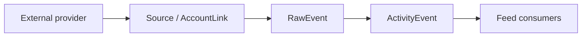

# Connectors and Ingestion

## Connector role

Connectors переводят внешние игровые и платформенные источники в внутренний activity stream.

## Built-in flow

```mermaid
flowchart LR
    External["External provider"]
    Source["Source / AccountLink"]
    Raw["RawEvent"]
    Normalized["ActivityEvent"]
    Feed["Feed consumers"]

    External --> Source --> Raw --> Normalized --> Feed
```

## Important domain objects

- `Source` описывает доступный коннектор и его конфигурацию.
- `AccountLink` связывает пользователя с внешней учетной записью.
- `RawEvent` хранит ingress payload для последующей нормализации или отладки.
- `ActivityEvent` - это основной feed-ready доменный объект.

## Why connectors are special

Этот слой одновременно затрагивает:

- privacy и legal basis;
- rate limiting и stability внешних API;
- нормализацию данных для feed;
- retention и purge политики.

## Contributor checklist

- описать какие данные приходят извне;
- минимизировать payload до реально нужного доменного набора;
- задокументировать retry/idempotency;
- покрыть тестами happy path и redaction-sensitive сценарии.
