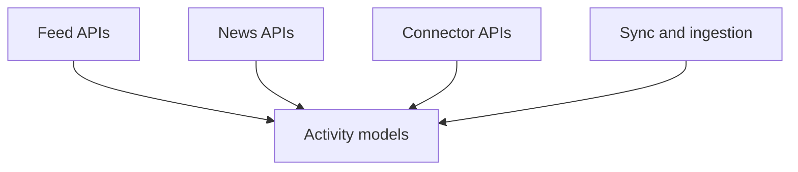
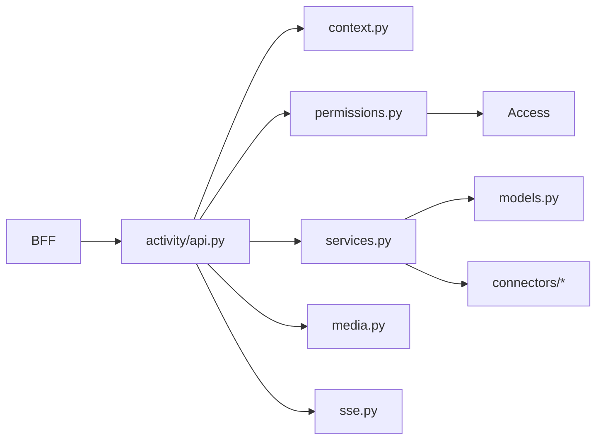
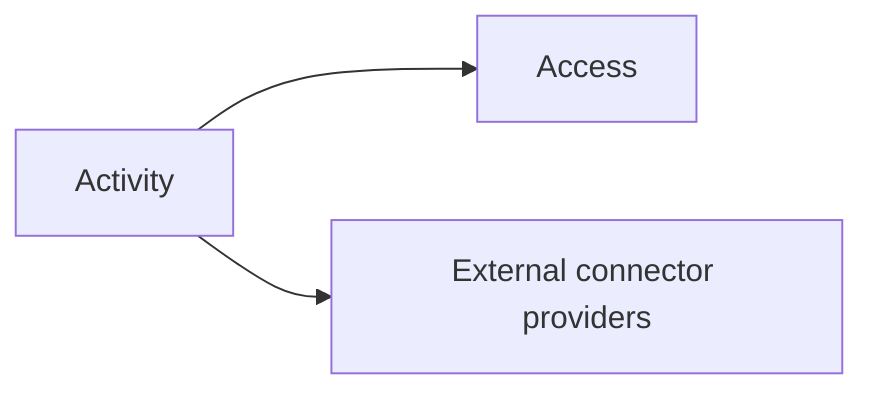

# Activity Overview

Activity - самый широкий по функциям сервис в platform mesh. Он объединяет feed, news, subscriptions и external connectors.

## Subdomains inside Activity

| Subdomain | Purpose |
| --- | --- |
| Feed | list feed, unread count, long-poll updates |
| News | posts, comments, reactions, media |
| Connectors | games, sources, account links, sync |
| Delivery | subscriptions and feed-side effects |
| Ingestion | raw events and normalized activity events |

## Main models

- `Game`
- `Source`
- `AccountLink`
- `RawEvent`
- `ActivityEvent`
- `NewsPost`
- `NewsReaction`
- `NewsComment`
- `NewsCommentReaction`
- `Subscription`
- `Outbox`
- `FeedLastSeen`

## Service shape

## Internal module graph

## Outbound interactions

## Why this service deserves extra care

Activity touches:

- user-generated content;
- external account linking;
- normalized behavioral events;
- media uploads;
- feed personalization.

Поэтому любые изменения здесь нужно смотреть одновременно как backend feature и как privacy-sensitive surface.
