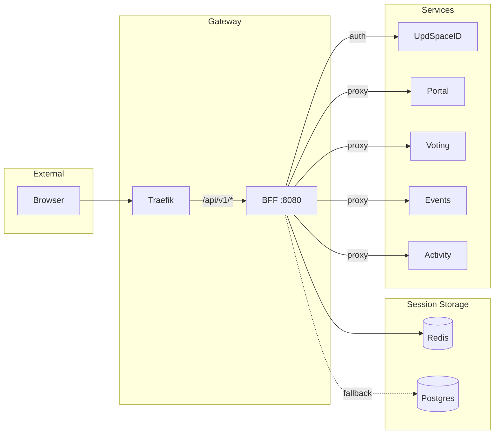

# BFF Gateway

**BFF (Backend For Frontend)** — единственная точка входа для фронтенда.

- **Path**: `services/bff`
- **Port**: 8080
- **URL**: `aef.updspace.com/api/v1/*` (через Traefik)

## Ключевые функции

1. **Session Management** — HttpOnly cookie, хранение в Redis
2. **Tenant Resolution** — определение tenant по subdomain
3. **Proxy** — проксирование запросов в микросервисы
4. **Context Injection** — добавление X-Headers с контекстом
5. **HMAC Signing** — подпись запросов для service-to-service

## Статус реализации

| Функционал | Статус |
|------------|--------|
| Session management | ✅ Done |
| OIDC login/callback | ✅ Done |
| Magic link flow | ✅ Done |
| Tenant resolution | ✅ Done |
| Proxy to services | ✅ Done |
| HMAC signing | ✅ Done |
| Rate limiting | ✅ Done |
| CSRF protection | ✅ Done |

## Архитектура



## Middleware Chain

```python
MIDDLEWARE = [
    "core.middleware.RequestIdMiddleware",      # X-Request-Id
    "core.middleware.ErrorHandlerMiddleware",   # Unified errors
    "bff.middleware.TenantMiddleware",          # Tenant resolution
    "bff.middleware.SessionMiddleware",         # Session from cookie
    "bff.middleware.CsrfMiddleware",            # CSRF protection
    "bff.middleware.RateLimitMiddleware",       # Rate limiting
]
```

### Request Flow

```
1. RequestIdMiddleware
   ↓ генерирует X-Request-Id
2. ErrorHandlerMiddleware
   ↓ оборачивает ошибки в единый формат
3. TenantMiddleware
   ↓ резолвит tenant из Host header
4. SessionMiddleware
   ↓ загружает сессию из cookie
5. CsrfMiddleware
   ↓ проверяет CSRF для mutating requests
6. RateLimitMiddleware
   ↓ применяет rate limits
7. Handler
```

## Session Storage

### Redis (Primary)

```python
class RedisSessionStore:
    prefix = "bff:session:"
    ttl = 14 * 24 * 60 * 60  # 14 days
    
    def get(self, session_id: str) -> Optional[Session]:
        data = redis.get(f"{self.prefix}{session_id}")
        return Session.parse(data) if data else None
    
    def set(self, session: Session):
        redis.setex(
            f"{self.prefix}{session.session_id}",
            self.ttl,
            session.serialize()
        )
```

### Postgres (Fallback)

```python
class Session(models.Model):
    session_id = models.UUIDField(primary_key=True)
    user_id = models.UUIDField()
    tenant_id = models.UUIDField()
    master_flags = models.JSONField()
    created_at = models.DateTimeField()
    expires_at = models.DateTimeField()
```

### Session Data

```json
{
  "session_id": "uuid",
  "user_id": "uuid",
  "tenant_id": "uuid",
  "master_flags": {
    "suspended": false,
    "banned": false,
    "system_admin": false,
    "email_verified": true,
    "membership_status": "active"
  },
  "created_at": "2026-01-14T12:00:00Z",
  "expires_at": "2026-01-28T12:00:00Z"
}
```

## Proxy Logic

### Headers Added to Upstream

```http
X-Request-Id: 550e8400-e29b-41d4-a716-446655440000
X-Tenant-Id: 123e4567-e89b-12d3-a456-426614174000
X-Tenant-Slug: aef
X-User-Id: 987fcdeb-51a2-4bc3-8def-0123456789ab
X-Master-Flags: {"suspended":false,"system_admin":false}
X-Updspace-Timestamp: 1705234567
X-Updspace-Signature: hmac_signature
```

### HMAC Signature

```python
def sign_request(method, path, body, request_id, timestamp, secret):
    body_hash = hashlib.sha256(body.encode()).hexdigest()
    message = f"{method}\n{path}\n{body_hash}\n{request_id}\n{timestamp}"
    return hmac.new(secret.encode(), message.encode(), hashlib.sha256).hexdigest()
```

### Routing Table

| Path Prefix | Target Service |
|-------------|----------------|
| `/api/v1/session/*` | BFF (handled locally) |
| `/api/v1/auth/*` | BFF (handled locally) |
| `/api/v1/portal/*` | Portal `:8003` |
| `/api/v1/voting/*` | Voting `:8004` |
| `/api/v1/events/*` | Events `:8005` |
| `/api/v1/activity/*` | Activity `:8006` |

## Cookie Settings

```python
SESSION_COOKIE_NAME = "updspace_session"
SESSION_COOKIE_HTTPONLY = True
SESSION_COOKIE_SECURE = True  # False in dev
SESSION_COOKIE_SAMESITE = "Lax"
SESSION_COOKIE_DOMAIN = ".updspace.com"  # ".localhost" in dev
SESSION_COOKIE_MAX_AGE = 14 * 24 * 60 * 60  # 14 days
```

## CORS Configuration

```python
CORS_ALLOWED_ORIGINS = [
    "https://aef.updspace.com",
    "https://id.updspace.com",
]

# Dev
CORS_ALLOWED_ORIGINS = [
    "http://aef.localhost",
    "http://id.localhost",
]

CORS_ALLOW_CREDENTIALS = True
```

## Rate Limiting

| Endpoint | Limit | Key |
|----------|-------|-----|
| `POST /session/login` | 10/min | IP |
| `GET /session/me` | 100/min | session_id |
| `POST /auth/*` | 20/min | IP |
| Proxy endpoints | 1000/min | session_id |

## Конфигурация

```bash
# Database
DATABASE_URL=postgres://user:pass@db_bff:5432/bff

# Redis
REDIS_URL=redis://redis:6379/1

# Session
SESSION_TTL=1209600  # 14 days in seconds
SESSION_COOKIE_DOMAIN=.updspace.com

# HMAC for service-to-service
BFF_INTERNAL_HMAC_SECRET=secret_key

# ID Service
UPDSPACEID_URL=http://updspaceid:8001
OIDC_CLIENT_ID=aef_bff
OIDC_CLIENT_SECRET=secret

# Services
PORTAL_URL=http://portal:8003
VOTING_URL=http://voting:8004
EVENTS_URL=http://events:8005
ACTIVITY_URL=http://activity:8006

# Dev mode
BFF_DEV_AUTO_TENANT=true  # Auto-create tenant if not exists
```
