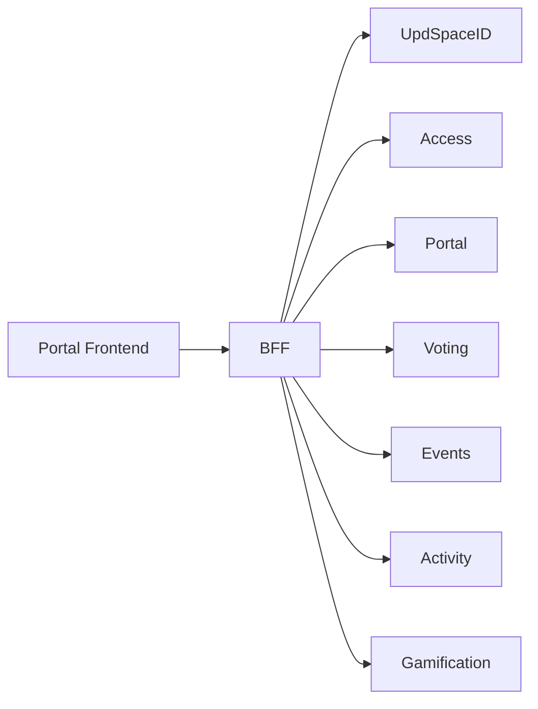
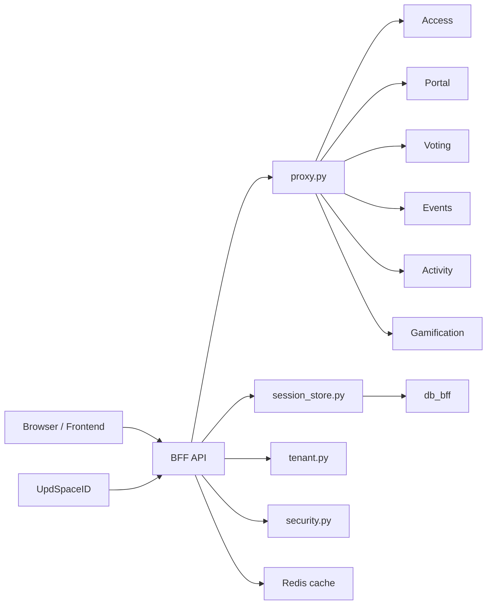
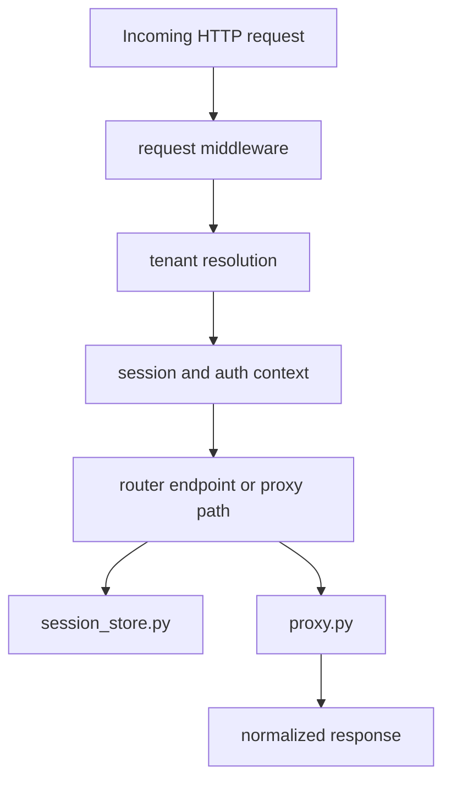

# BFF Overview

BFF - это единственная поддерживаемая browser-facing backend surface платформы. Он объединяет session management, auth proxying, tenant selection и routing к доменным сервисам.

## Responsibilities

- материализация browser session;
- разрешение активного tenant;
- нормализация auth/login/callback flows;
- proxying запросов к внутренним сервисам;
- прокидывание internal context headers;
- агрегация части session bootstrap ответа.

## Main modules in code

| Module | Purpose |
| --- | --- |
| `bff/api.py` | router, login flows, session endpoints, proxy endpoints |
| `bff/session_store.py` | хранение и отзыв BFF sessions |
| `bff/proxy.py` | forwarding request/response between BFF and upstream services |
| `bff/security.py` | HMAC verification and callback secret handling |
| `bff/tenant.py` | tenant resolution and validation |
| `bff/models.py` | `Tenant`, `BffSession` |

## Runtime position

```mermaid
flowchart LR
    Frontend["Portal Frontend"] --> BFF["BFF"]
    BFF --> ID["UpdSpaceID"]
    BFF --> Access["Access"]
    BFF --> Portal["Portal"]
    BFF --> Voting["Voting"]
    BFF --> Events["Events"]
    BFF --> Activity["Activity"]
    BFF --> Gamification["Gamification"]
```

## Inbound and outbound graph

```mermaid
flowchart LR
    Browser["Browser / Frontend"] --> BFF["BFF API"]
    ID["UpdSpaceID"] --> BFF
    BFF --> Proxy["proxy.py"]
    BFF --> Session["session_store.py"]
    BFF --> Tenant["tenant.py"]
    BFF --> Security["security.py"]
    Proxy --> Access["Access"]
    Proxy --> Portal["Portal"]
    Proxy --> Voting["Voting"]
    Proxy --> Events["Events"]
    Proxy --> Activity["Activity"]
    Proxy --> Gamification["Gamification"]
    Session --> DB["db_bff"]
    BFF --> Redis["Redis cache"]
```

## Request flow inside BFF

```mermaid
flowchart TD
    Request["Incoming HTTP request"] --> Middleware["request middleware"]
    Middleware --> TenantResolve["tenant resolution"]
    TenantResolve --> AuthResolve["session and auth context"]
    AuthResolve --> Route["router endpoint or proxy path"]
    Route --> SessionStore["session_store.py"]
    Route --> Proxy["proxy.py"]
    Proxy --> Response["normalized response"]
```

## Data owned by BFF

- active tenants known to the frontend context;
- browser session records;
- cookie/session lifecycle metadata.

BFF не должен становиться доменным хранилищем для профилей, ролей, событий или голосований.

## What is canonical for new work

Если feature видна пользователю через browser, новая интеграция должна появляться в одном из двух вариантов:

- как proxy surface через BFF;
- как BFF-owned orchestration endpoint, если нужен composite response или session-aware logic.

Прямой browser call в доменный сервис считается отклонением от архитектуры.
