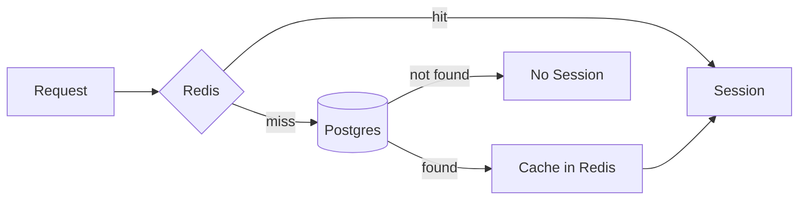
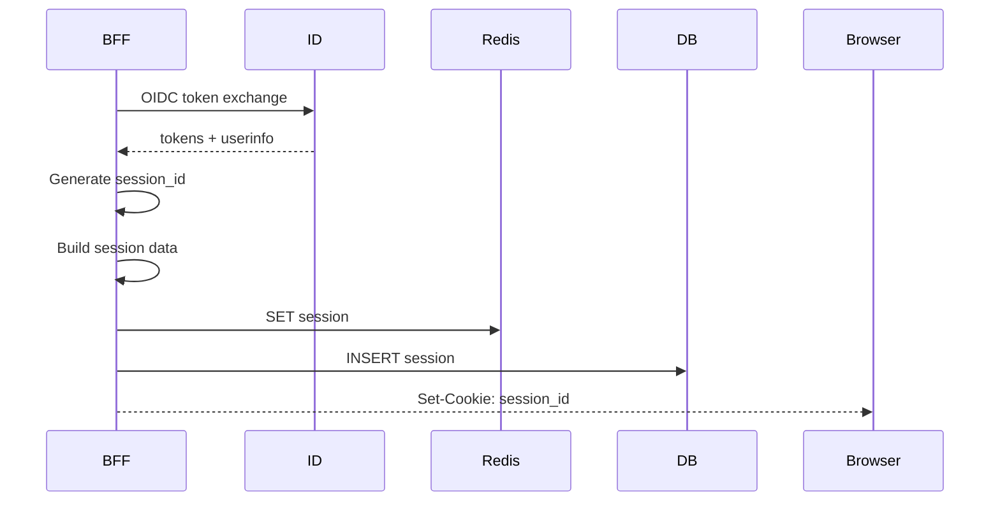

# Session Management

BFF отвечает за хранение и управление сессиями пользователей.

## Session Model

```python
@dataclass
class Session:
    session_id: UUID
    user_id: UUID
    tenant_id: UUID
    master_flags: dict
    created_at: datetime
    expires_at: datetime
    
    @property
    def is_expired(self) -> bool:
        return datetime.utcnow() > self.expires_at
```

### Master Flags

```python
master_flags = {
    "suspended": False,      # Аккаунт приостановлен
    "banned": False,         # Аккаунт заблокирован
    "system_admin": False,   # Системный администратор
    "email_verified": True,  # Email подтверждён
    "membership_status": "active",  # Статус в tenant
}
```

## Storage Architecture



### Redis (Primary)

```python
class RedisSessionStore:
    def __init__(self, redis_client, ttl=14*24*60*60):
        self.redis = redis_client
        self.ttl = ttl
        self.prefix = "bff:session:"
    
    def get(self, session_id: str) -> Optional[Session]:
        key = f"{self.prefix}{session_id}"
        data = self.redis.get(key)
        if not data:
            return None
        return Session.from_json(data)
    
    def set(self, session: Session):
        key = f"{self.prefix}{session.session_id}"
        self.redis.setex(key, self.ttl, session.to_json())
    
    def delete(self, session_id: str):
        key = f"{self.prefix}{session_id}"
        self.redis.delete(key)
```

### Postgres (Fallback)

```python
class SessionModel(models.Model):
    session_id = models.UUIDField(primary_key=True)
    user_id = models.UUIDField(db_index=True)
    tenant_id = models.UUIDField(db_index=True)
    master_flags = models.JSONField(default=dict)
    created_at = models.DateTimeField(auto_now_add=True)
    expires_at = models.DateTimeField(db_index=True)
    
    class Meta:
        db_table = "bff_sessions"
```

### Hybrid Store

```python
class HybridSessionStore:
    def __init__(self, redis_store, db_store):
        self.redis = redis_store
        self.db = db_store
    
    def get(self, session_id: str) -> Optional[Session]:
        # Try Redis first
        session = self.redis.get(session_id)
        if session:
            return session
        
        # Fallback to DB
        session = self.db.get(session_id)
        if session:
            # Warm up cache
            self.redis.set(session)
        
        return session
    
    def set(self, session: Session):
        self.redis.set(session)
        self.db.set(session)
    
    def delete(self, session_id: str):
        self.redis.delete(session_id)
        self.db.delete(session_id)
```

## Session Lifecycle

### Create Session



```python
def create_session(user_info: dict, tenant_id: UUID) -> Session:
    session = Session(
        session_id=uuid.uuid4(),
        user_id=UUID(user_info["sub"]),
        tenant_id=tenant_id,
        master_flags=user_info.get("master_flags", {}),
        created_at=datetime.utcnow(),
        expires_at=datetime.utcnow() + timedelta(days=14),
    )
    
    session_store.set(session)
    return session
```

### Load Session

```python
class SessionMiddleware:
    def __call__(self, request):
        session_id = request.COOKIES.get("updspace_session")
        
        if not session_id:
            request.session = None
            return self.get_response(request)
        
        session = session_store.get(session_id)
        
        if session and session.is_expired:
            session_store.delete(session_id)
            session = None
        
        request.session = session
        return self.get_response(request)
```

### Logout

```python
@api.post("/session/logout")
def logout(request):
    session_id = request.COOKIES.get("updspace_session")
    
    if session_id:
        session_store.delete(session_id)
    
    response = JsonResponse({"logged_out": True})
    response.delete_cookie("updspace_session")
    return response
```

## Cookie Configuration

```python
def set_session_cookie(response, session_id: str):
    response.set_cookie(
        key="updspace_session",
        value=str(session_id),
        max_age=14 * 24 * 60 * 60,  # 14 days
        httponly=True,              # No JS access
        secure=not settings.DEBUG,  # HTTPS only in prod
        samesite="Lax",             # CSRF protection
        domain=settings.SESSION_COOKIE_DOMAIN,  # .updspace.com
    )
```

## Refresh Master Flags

Master flags могут измениться (например, пользователь забанен). BFF периодически обновляет:

```python
async def refresh_master_flags(session: Session) -> Session:
    # Call ID service to get fresh data
    user_info = await id_client.get_userinfo(session.user_id)
    
    if user_info["master_flags"] != session.master_flags:
        session.master_flags = user_info["master_flags"]
        session_store.set(session)
    
    return session
```

### Когда обновлять

1. **При каждом запросе** (overhead, но свежие данные)
2. **Периодически** (например, раз в 5 минут)
3. **При ошибке авторизации** (403 от сервиса)

Текущая реализация: при каждом `/session/me`.

## Multiple Sessions

Пользователь может иметь несколько активных сессий (разные устройства):

```python
def get_user_sessions(user_id: UUID) -> List[Session]:
    return SessionModel.objects.filter(
        user_id=user_id,
        expires_at__gt=datetime.utcnow()
    )

def invalidate_all_sessions(user_id: UUID):
    """Logout everywhere"""
    sessions = get_user_sessions(user_id)
    for session in sessions:
        session_store.delete(session.session_id)
```

## Security

### Session Fixation Prevention

```python
def on_login(request, old_session_id: str) -> Session:
    # Always create new session ID on login
    if old_session_id:
        session_store.delete(old_session_id)
    
    return create_session(...)
```

### Session Binding

Опционально можно привязать сессию к fingerprint:

```python
@dataclass
class Session:
    # ...
    ip_hash: str = ""
    ua_hash: str = ""

def validate_session(session: Session, request) -> bool:
    if session.ip_hash and session.ip_hash != hash_ip(request):
        return False
    if session.ua_hash and session.ua_hash != hash_ua(request):
        return False
    return True
```
