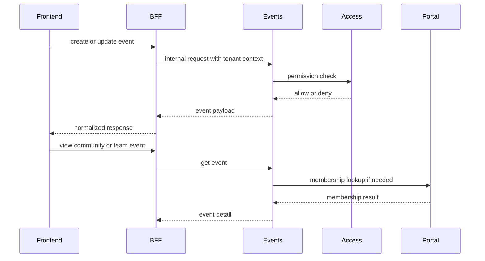

# Event Lifecycle and Integrations

## Lifecycle

## Integration notes

- `Portal` используется как membership authority для community/team scopes.
- `Access` остается authority по capability checks.
- `ICS` export делает Events useful вне UI, например для calendar clients.

## Why Event scope matters

У события есть не только `tenant_id`, но и domain-specific scope:

- tenant-wide;
- community-scoped;
- team-scoped;
- потенциально другие сценарии в будущем.

Это значит, что visibility и permission logic нельзя сводить к одному булевому флагу.
