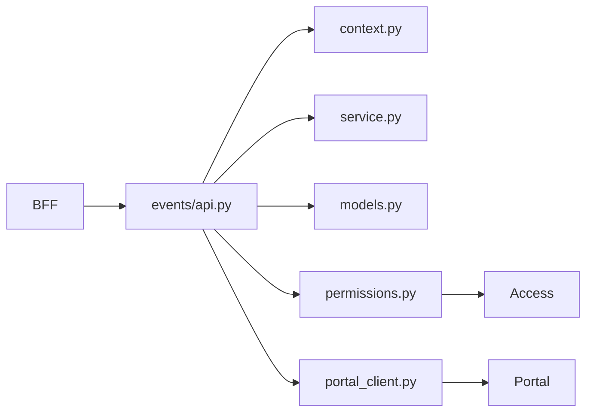

# Events Overview

Events обслуживает календарную и attendance-логику tenant-а.

## Main API families

| Endpoint | Purpose |
| --- | --- |
| `GET /events` | list visible events |
| `POST /events` | create event |
| `GET /events/{id}` | event detail |
| `PATCH /events/{id}` | update event |
| `POST /events/{id}/rsvp` | set RSVP |
| `POST /events/{id}/attendance` | mark attendance |
| `GET /events/{id}/ics` | export ICS file |

## Main models

- `Event`
- `RSVP`
- `Attendance`
- `OutboxMessage`

## External dependencies

Events использует:

- `Access` для permission checks;
- `Portal` для community/team membership lookups;
- BFF как единственный browser entrypoint.

## Internal request graph

## Visibility model

Event visibility зависит от:

- tenant membership;
- explicit event visibility;
- scope type и scope id;
- capability checks.
