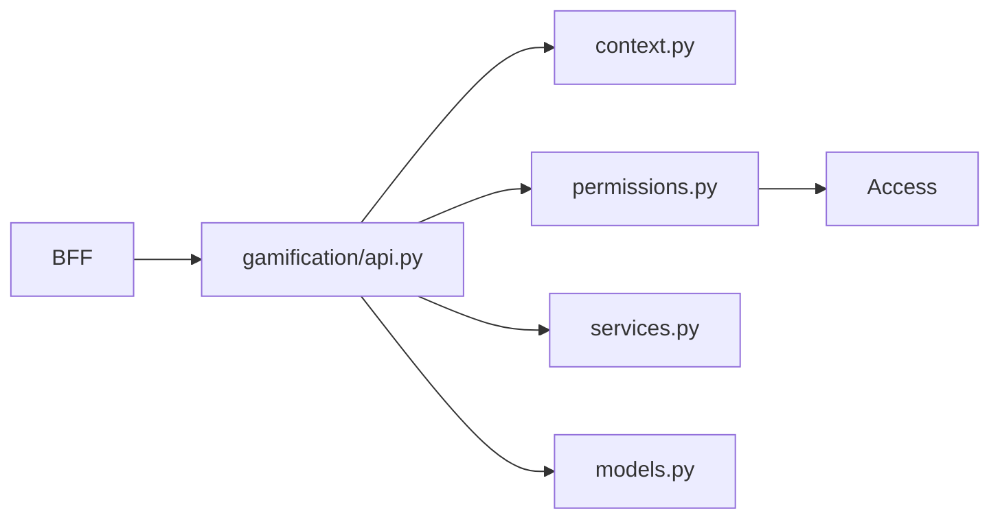

# Gamification Overview

Gamification отвечает за recognition layer внутри tenant-а: achievements, categories и grants.

## Main API families

| Endpoint | Purpose |
| --- | --- |
| `GET /gamification/achievements` | list achievements |
| `POST /gamification/achievements` | create achievement |
| `PATCH /gamification/achievements/{id}` | update achievement |
| `POST /gamification/achievements/{id}/grants` | issue grant |
| `POST /gamification/grants/{id}/revoke` | revoke grant |
| `GET/POST/PATCH /gamification/categories` | category management |

## Main dependencies

- `Access` for permission checks;
- `Portal` profile catalog indirectly through frontend/admin UX;
- `BFF` as browser entrypoint.

## Capability-heavy domain

Gamification использует богатый набор capability keys:

- create
- edit
- publish
- hide
- assign
- revoke
- view_private

Это значит, что многие UX paths зависят не от одной роли, а от комбинации прав.

## Internal architecture graph

