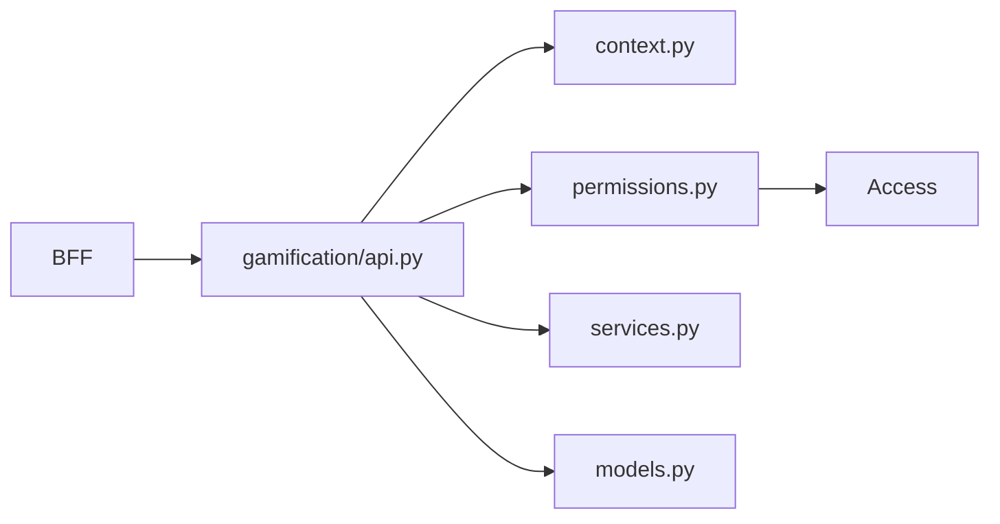

# Gamification Overview

Gamification отвечает за recognition layer внутри tenant-а: achievements, categories и grants.

## Main API families

| Endpoint | Purpose |
| --- | --- |
| `GET /gamification/achievements` | list achievements |
| `POST /gamification/achievements` | create achievement |
| `PATCH /gamification/achievements/{id}` | update achievement |
| `POST /gamification/achievements/{id}/grants` | issue grant |
| `POST /gamification/grants/{id}/revoke` | revoke grant |
| `GET/POST/PATCH /gamification/categories` | category management |

## Main dependencies

- `Access` for permission checks;
- `Portal` profile catalog indirectly through frontend/admin UX;
- `BFF` as browser entrypoint.

## Capability-heavy domain

Gamification использует богатый набор capability keys:

- create
- edit
- publish
- hide
- assign
- revoke
- view_private

Это значит, что многие UX paths зависят не от одной роли, а от комбинации прав.

## Internal architecture graph

```mermaid
flowchart LR
    BFF["BFF"] --> API["gamification/api.py"]
    API --> Context["context.py"]
    API --> Permissions["permissions.py"]
    API --> Services["services.py"]
    API --> Models["models.py"]
    Permissions --> Access["Access"]
```

## Изображения и категории

Frontend загружает файл через `POST /api/v1/gamification/media` на BFF
(`multipart/form-data`, поле `file`). Допустимы PNG, JPEG и WebP до 2 MiB и
25 миллионов пикселей; проверяется содержимое файла. Требуется
`gamification.achievements.create` либо `gamification.achievements.edit`.
Ответ: `{ "url": "/api/v1/gamification/media/<uuid>" }`; этот адрес сохраняется
в `images` достижения. Чтение по нему требует `gamification.achievements.read`
и использует только пространство текущего tenant.

Файлы хранятся в существующем приватном S3 media bucket, под ключами
`achievements/<tenant_id>/<uuid>`. Настройки: `ACHIEVEMENT_MEDIA_BUCKET`,
`S3_ENDPOINT_URL`, `S3_REGION`, `S3_ACCESS_KEY_ID`, `S3_SECRET_ACCESS_KEY`.
Без настроенного bucket загрузка возвращает `503 MEDIA_UNAVAILABLE`.
Никакие S3 credentials или публичные ACL клиенту не передаются.

Для создания категории теперь требуется отдельное право
`gamification.categories.manage`. Право создавать достижения его не заменяет.
Access добавляет право миграцией/`seed_access_defaults`; выдача ролям выполняется
явно. Категория `Fun` (`fun`) создаётся идемпотентно при первом чтении категорий
сообщества. UUID детерминирован для tenant, существующая категория не изменяется.
