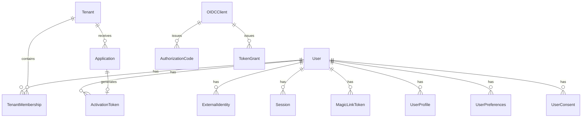

# Модели данных UpdSpaceID

## Диаграмма связей



## Core Identity Models

### Tenant

```python
class Tenant(models.Model):
    id = models.UUIDField(primary_key=True, default=uuid.uuid4)
    slug = models.CharField(max_length=50, unique=True)  # "aef"
    name = models.CharField(max_length=255)              # "AEF Community"
    settings = models.JSONField(default=dict)
    created_at = models.DateTimeField(auto_now_add=True)
    
    class Meta:
        db_table = "tenants"
```

### UpdSpaceUser

```python
class UpdSpaceUser(models.Model):
    """Пользователь UpdSpace (отдельный от Django User)"""
    id = models.UUIDField(primary_key=True, default=uuid.uuid4)
    username = models.CharField(max_length=150, unique=True)
    email = models.EmailField(unique=True)
    email_verified = models.BooleanField(default=False)
    display_name = models.CharField(max_length=255, blank=True)
    
    # Master flags
    status = models.CharField(max_length=20, default="pending")
    # Values: pending, active, suspended, banned, migrated_unclaimed
    
    system_admin = models.BooleanField(default=False)
    
    created_at = models.DateTimeField(auto_now_add=True)
    updated_at = models.DateTimeField(auto_now=True)
    
    class Meta:
        db_table = "updspace_users"
```

### TenantMembership

```python
class TenantMembership(models.Model):
    """Членство пользователя в tenant"""
    id = models.UUIDField(primary_key=True, default=uuid.uuid4)
    user = models.ForeignKey(UpdSpaceUser, on_delete=models.CASCADE)
    tenant = models.ForeignKey(Tenant, on_delete=models.CASCADE)
    
    status = models.CharField(max_length=20, default="active")
    # Values: active, disabled
    
    base_role = models.CharField(max_length=50, default="member")
    # Values: member, admin
    
    joined_at = models.DateTimeField(auto_now_add=True)
    
    class Meta:
        db_table = "tenant_memberships"
        unique_together = [["user", "tenant"]]
```

## Application & Activation

### Application

```python
class Application(models.Model):
    """Заявка на регистрацию"""
    id = models.UUIDField(primary_key=True, default=uuid.uuid4)
    tenant_slug = models.CharField(max_length=50)
    
    # Данные заявки
    email = models.EmailField()
    payload = models.JSONField(default=dict)
    # payload: {name, motivation, referral, ...}
    
    status = models.CharField(max_length=20, default="pending")
    # Values: pending, approved, rejected
    
    created_at = models.DateTimeField(auto_now_add=True)
    reviewed_by = models.ForeignKey(UpdSpaceUser, null=True, on_delete=models.SET_NULL)
    reviewed_at = models.DateTimeField(null=True)
    review_note = models.TextField(blank=True)
    
    class Meta:
        db_table = "applications"
```

### ActivationToken

```python
class ActivationToken(models.Model):
    """Одноразовый токен активации"""
    token = models.CharField(max_length=255, primary_key=True)  # хранится хэш (HMAC)
    user = models.ForeignKey(UpdSpaceUser, on_delete=models.CASCADE)
    tenant = models.ForeignKey(Tenant, on_delete=models.CASCADE)
    
    expires_at = models.DateTimeField()
    used_at = models.DateTimeField(null=True)
    
    created_at = models.DateTimeField(auto_now_add=True)
    
    class Meta:
        db_table = "activation_tokens"
```

### MagicLinkToken

```python
class MagicLinkToken(models.Model):
    """Magic link для входа"""
    token = models.CharField(max_length=255, primary_key=True)  # хранится хэш (HMAC)
    user = models.ForeignKey(UpdSpaceUser, on_delete=models.CASCADE)
    
    expires_at = models.DateTimeField()
    used_at = models.DateTimeField(null=True)
    
    # Security context
    ip_hash = models.CharField(max_length=64, blank=True)
    ua_hash = models.CharField(max_length=64, blank=True)
    
    created_at = models.DateTimeField(auto_now_add=True)
    
    class Meta:
        db_table = "magic_link_tokens"
```

## OAuth & External Identity

### ExternalIdentity

```python
class ExternalIdentity(models.Model):
    """Связь с внешним OAuth провайдером"""
    id = models.UUIDField(primary_key=True, default=uuid.uuid4)
    user = models.ForeignKey(UpdSpaceUser, on_delete=models.CASCADE)
    
    provider = models.CharField(max_length=50)
    # Values: github, discord, steam
    
    subject = models.CharField(max_length=255)
    # GitHub user id, Discord user id, SteamID64
    
    # Cached provider data
    provider_username = models.CharField(max_length=255, blank=True)
    tokens_json = models.JSONField(null=True)  # Encrypted
    
    created_at = models.DateTimeField(auto_now_add=True)
    last_used_at = models.DateTimeField(null=True)
    
    class Meta:
        db_table = "external_identities"
        unique_together = [["provider", "subject"]]
```

### OAuthState

```python
class OAuthState(models.Model):
    """Временное состояние для OAuth flow"""
    state = models.CharField(max_length=255, primary_key=True)
    
    provider = models.CharField(max_length=50)
    action = models.CharField(max_length=20)  # link, login
    
    user_id = models.UUIDField(null=True)  # Для linking
    redirect_uri = models.URLField()
    nonce = models.CharField(max_length=255)
    
    expires_at = models.DateTimeField()
    created_at = models.DateTimeField(auto_now_add=True)
    
    class Meta:
        db_table = "oauth_states"
```

## OIDC Provider Models

### OIDCClient

```python
class OIDCClient(models.Model):
    """Зарегистрированное OIDC приложение"""
    client_id = models.CharField(max_length=255, primary_key=True)
    client_secret = models.CharField(max_length=255)  # Hashed
    
    name = models.CharField(max_length=255)
    redirect_uris = models.JSONField()  # List of allowed URIs
    
    allowed_scopes = models.JSONField(default=list)
    # ["openid", "profile", "email"]
    
    is_active = models.BooleanField(default=True)
    created_at = models.DateTimeField(auto_now_add=True)
    
    class Meta:
        db_table = "oidc_clients"
```

### AuthorizationCode

```python
class AuthorizationCode(models.Model):
    """OAuth2 authorization code"""
    code = models.CharField(max_length=255, primary_key=True)
    
    client = models.ForeignKey(OIDCClient, on_delete=models.CASCADE)
    user = models.ForeignKey(UpdSpaceUser, on_delete=models.CASCADE)
    
    redirect_uri = models.URLField()
    scopes = models.JSONField()
    nonce = models.CharField(max_length=255, blank=True)
    code_challenge = models.CharField(max_length=255, blank=True)  # PKCE
    
    expires_at = models.DateTimeField()
    used_at = models.DateTimeField(null=True)
    
    class Meta:
        db_table = "authorization_codes"
```

## User Profile Models

### UserProfile

```python
class UserProfile(models.Model):
    user = models.OneToOneField(UpdSpaceUser, on_delete=models.CASCADE)
    
    avatar_url = models.URLField(blank=True)
    phone = models.CharField(max_length=20, blank=True)
    birthday = models.DateField(null=True)
    bio = models.TextField(blank=True)
    
    updated_at = models.DateTimeField(auto_now=True)
```

### UserPreferences

```python
class UserPreferences(models.Model):
    user = models.OneToOneField(UpdSpaceUser, on_delete=models.CASCADE)
    
    language = models.CharField(max_length=5, default="ru")
    timezone = models.CharField(max_length=50, default="UTC")
    marketing_emails = models.BooleanField(default=False)
```

## Audit & Migration

### AuditLog

```python
class AuditLog(models.Model):
    id = models.BigAutoField(primary_key=True)
    actor_user = models.ForeignKey(User, on_delete=models.SET_NULL, null=True)
    action = models.CharField(max_length=64)
    target_type = models.CharField(max_length=64)
    target_id = models.CharField(max_length=128)
    tenant = models.ForeignKey(Tenant, on_delete=models.SET_NULL, null=True)
    meta_json = models.JSONField(default=dict)
    created_at = models.DateTimeField(default=timezone.now)
```

### OutboxEvent

```python
class OutboxEvent(models.Model):
    id = models.BigAutoField(primary_key=True)
    tenant = models.ForeignKey(Tenant, on_delete=models.CASCADE)
    event_type = models.CharField(max_length=64)
    payload_json = models.JSONField(default=dict)
    created_at = models.DateTimeField(default=timezone.now)
    processed_at = models.DateTimeField(null=True, blank=True)
    attempts = models.IntegerField(default=0)
    last_error = models.TextField(blank=True)
```

### MigrationMap

```python
class MigrationMap(models.Model):
    """Маппинг для миграции из legacy систем"""
    id = models.BigAutoField(primary_key=True)
    old_system = models.CharField(max_length=64)  # "aefvote_legacy"
    old_user_id = models.CharField(max_length=128)
    user = models.ForeignKey(User, on_delete=models.CASCADE)
    created_at = models.DateTimeField(default=timezone.now)

    class Meta:
        unique_together = [["old_system", "old_user_id"]]
```
