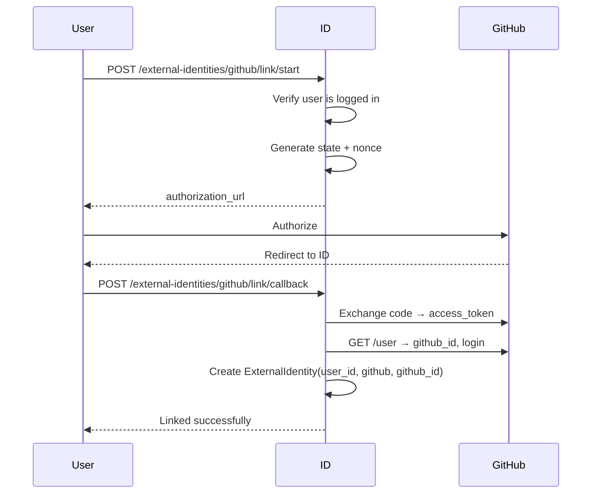

# OAuth Providers

UpdSpaceID поддерживает linking и login через внешние OAuth провайдеры.

## Важно: OAuth НЕ создаёт аккаунт!

```
OAuth providers могут только:
1. LINKING: Привязать к существующему аккаунту (пользователь залогинен)
2. LOGIN: Войти, если ExternalIdentity уже привязана

Попытка login без привязки → ACCOUNT_NOT_LINKED
```

## Поддерживаемые провайдеры

| Provider | Subject | Scopes | Статус |
|----------|---------|--------|--------|
| GitHub | GitHub User ID | `read:user` | ✅ Production |
| Discord | Discord User ID | `identify` | ✅ Production |
| Steam | SteamID64 | OpenID | ✅ Production |

## GitHub

### Linking Flow



### Конфигурация

```bash
GITHUB_CLIENT_ID=your_client_id
GITHUB_CLIENT_SECRET=your_client_secret
GITHUB_REDIRECT_URIS=https://aef.updspace.com/settings
GITHUB_SCOPES=read:user
```

### OAuth URLs

- Authorization: `https://github.com/login/oauth/authorize`
- Token: `https://github.com/login/oauth/access_token`
- User API: `https://api.github.com/user`

### Stored Data

```python
ExternalIdentity(
    provider="github",
    subject="12345",  # GitHub user id
    provider_username="octocat",
    tokens_json=None  # Не храним токены
)
```

## Discord

### Linking Flow

Аналогично GitHub, но с другими endpoints.

### Конфигурация

```bash
DISCORD_CLIENT_ID=your_client_id
DISCORD_CLIENT_SECRET=your_client_secret
DISCORD_REDIRECT_URIS=https://aef.updspace.com/settings
DISCORD_SCOPES=identify
```

### OAuth URLs

- Authorization: `https://discord.com/api/oauth2/authorize`
- Token: `https://discord.com/api/oauth2/token`
- User API: `https://discord.com/api/users/@me`

### Scopes

- `identify` — базовая информация (id, username, avatar)
- `email` — email пользователя (опционально)

### Stored Data

```python
ExternalIdentity(
    provider="discord",
    subject="987654321",  # Discord user id
    provider_username="user#1234",
    tokens_json=None
)
```

## Steam

Steam использует OpenID (не OAuth2), но интегрирован аналогично.

### Login URL

```
https://steamcommunity.com/openid/login
```

### Конфигурация

```bash
STEAM_API_KEY=your_api_key  # Для получения дополнительной информации
STEAM_REDIRECT_URIS=https://aef.updspace.com/settings
```

### Stored Data

```python
ExternalIdentity(
    provider="steam",
    subject="76561198012345678",  # SteamID64
    provider_username="SteamUser",
    tokens_json=None
)
```

### Важные ограничения Steam

1. **Нет email**: Steam не предоставляет email
2. **Публичность профиля**: Проверить можно только публичную информацию
3. **Web API лимиты**: 100,000 requests/day

### OpenID callback payload

ID сервис ожидает `openid_params` (или минимум `claimed_id`) при вызове
`/external-identities/steam/link/callback` и `/oauth/steam/login/callback`.

## OIDC Provider (ID как провайдер)

UpdSpaceID также работает как OIDC Provider для других приложений (BFF, Portal).

### Discovery

```http
GET /.well-known/openid-configuration
```

```json
{
  "issuer": "https://id.updspace.com",
  "authorization_endpoint": "https://id.updspace.com/api/v1/oauth/authorize",
  "token_endpoint": "https://id.updspace.com/api/v1/oauth/token",
  "userinfo_endpoint": "https://id.updspace.com/api/v1/oauth/userinfo",
  "jwks_uri": "https://id.updspace.com/.well-known/jwks.json",
  "scopes_supported": ["openid", "profile", "email"],
  "response_types_supported": ["code"],
  "grant_types_supported": ["authorization_code", "refresh_token"],
  "token_endpoint_auth_methods_supported": ["client_secret_basic", "client_secret_post"],
  "revocation_endpoint": "https://id.updspace.com/api/v1/oauth/revoke",
  "code_challenge_methods_supported": ["plain", "S256"],
  "subject_types_supported": ["public"],
  "id_token_signing_alg_values_supported": ["RS256"]
}
```

> **Key rotation:** `.well-known/jwks.json` lists every configured key pair (active and retired) so clients can continue validating tokens during a rotation.
> `/.well-known/jwks.json` mirrors `/oauth/jwks` and is the default `OIDC_JWKS_URI` (https://id.updspace.com/.well-known/jwks.json). Override `OIDC_JWKS_URI` when your discovery metadata lives under a different hostname or path, but keep retired keys in the JWKS payload so existing tokens can still be verified.

### Registered Clients

| Client | client_id | redirect_uris | Назначение |
|--------|-----------|---------------|------------|
| BFF AEF | `aef_bff` | `http://aef.localhost/api/v1/auth/callback` | Portal auth |
| BFF Gaming | `gaming_bff` | `http://gaming.localhost/api/v1/auth/callback` | Другой tenant |

### Token Response

```json
{
  "access_token": "eyJ...",
  "token_type": "Bearer",
  "expires_in": 3600,
  "refresh_token": "xyz...",
  "id_token": "eyJ...",
  "scope": "openid profile email"
}
```

### ID Token Claims

```json
{
  "iss": "https://id.updspace.com",
  "sub": "user-uuid",
  "aud": "aef_bff",
  "exp": 1705238167,
  "iat": 1705234567,
  "nonce": "abc123",
  "email": "user@example.com",
  "email_verified": true,
  "name": "Иван Иванов",
  "preferred_username": "ivan"
}
```

### Userinfo Response

```json
{
  "sub": "user-uuid",
  "email": "user@example.com",
  "email_verified": true,
  "name": "Иван Иванов",
  "preferred_username": "ivan",
  "picture": "https://avatars.updspace.com/user-uuid.jpg",
  "updated_at": 1705234567,
  "master_flags": {
    "suspended": false,
    "banned": false,
    "system_admin": false
  },
  "memberships": [
    {
      "tenant_id": "tenant-uuid",
      "tenant_slug": "aef",
      "status": "active",
      "base_role": "member"
    }
  ]
}
```

## Security Considerations

### Redirect URI allowlist

Каждый провайдер принимает `redirect_uri` только из allowlist (`*_REDIRECT_URIS`),
чтобы исключить open redirect и нежелательные OAuth flows.

### State Parameter

Обязателен для всех OAuth flows:

```python
state = secrets.token_urlsafe(32)
# Store in session/DB with expiration
```

### Nonce (для OIDC)

Защита от replay attacks:

```python
nonce = secrets.token_urlsafe(32)
# Include in authorization request
# Verify in id_token
```

### Anti-Replay

```python
def validate_callback(code, state):
    oauth_state = OAuthState.objects.get(state=state)
    
    if oauth_state.used_at:
        raise SecurityError("State already used")
    
    oauth_state.used_at = timezone.now()
    oauth_state.save()
```

### Rate Limiting

| Endpoint | Limit |
|----------|-------|
| `/link/start` | 10/minute per user |
| `/link/callback` | 10/minute per user |
| `/login/start` | 20/minute per IP |
