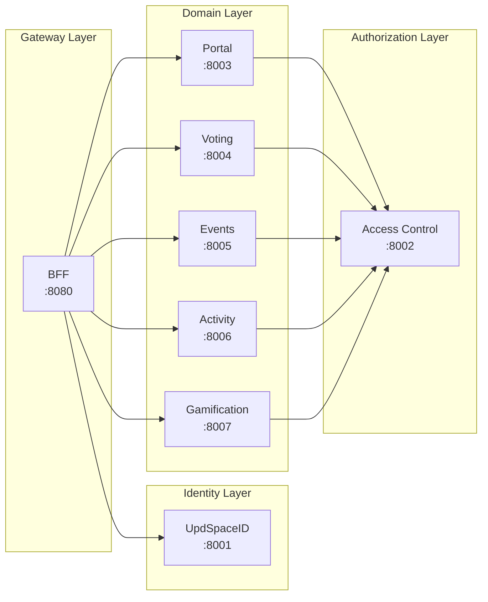
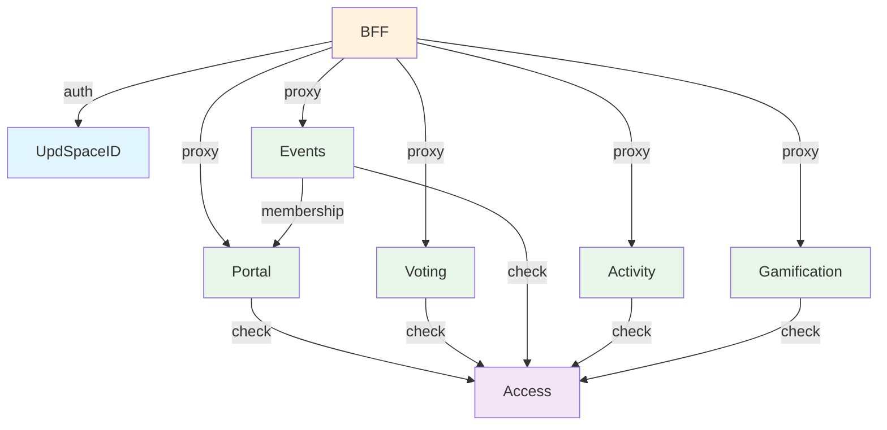

# Обзор сервисов

Платформа состоит из 8 микросервисов + 2 frontend приложений.

## Карта сервисов



## Таблица сервисов

| Сервис | Порт | Path | Статус | Описание |
|--------|------|------|--------|----------|
| **UpdSpaceID** | 8001 | `services/id` | ✅ Production | Identity, SSO, OAuth |
| **BFF** | 8080 | `services/bff` | ✅ Production | API Gateway, Sessions |
| **Access** | 8002 | `services/access` | ✅ Production | RBAC, Permissions |
| **Portal** | 8003 | `services/portal` | ✅ MVP | Communities, Teams |
| **Voting** | 8004 | `services/voting` | ✅ MVP | Polls, Votes |
| **Events** | 8005 | `services/events` | ✅ MVP | Calendar, RSVP |
| **Activity** | 8006 | `services/activity` | 🔶 Early MVP | Feed, Connectors |
| **Gamification** | 8007 | `services/gamification` | ✅ MVP | Achievements, Grants |

## Статусы

| Иконка | Статус | Описание |
|--------|--------|----------|
| ✅ | Production | Полностью реализовано и протестировано |
| ✅ | MVP | Базовый функционал работает |
| 🔶 | Early MVP | Частичная реализация, есть заглушки |
| 🔴 | Not Started | Не реализовано |

## Технологический стек

Все сервисы используют единый стек:

```
Python 3.12+
├── Django 5.x (ORM, migrations)
├── Django Ninja (REST API, OpenAPI)
├── PostgreSQL (storage)
├── Redis (cache, sessions - только BFF и ID)
└── uvicorn/gunicorn (ASGI server)
```

## Структура сервиса

Каждый сервис имеет стандартную структуру:

```
services/example/
├── Dockerfile
├── pyproject.toml
└── src/
    ├── manage.py
    ├── app/
    │   ├── settings.py
    │   ├── urls.py
    │   └── wsgi.py
    ├── core/
    │   ├── context.py      # Request context
    │   └── errors.py       # Error handling
    └── example/            # Domain module
        ├── __init__.py
        ├── api.py          # Ninja router
        ├── models.py       # Django models
        ├── schemas.py      # Pydantic schemas
        ├── services.py     # Business logic
        └── tests/
```

## Общие компоненты

### Context Headers

Все сервисы получают от BFF:

```http
X-Request-Id: uuid
X-Tenant-Id: uuid
X-Tenant-Slug: string
X-User-Id: uuid
X-Master-Flags: {"suspended": false, "system_admin": false}
X-Updspace-Timestamp: unix_timestamp
X-Updspace-Signature: hmac_sha256
```

### Error Format

```json
{
  "error": {
    "code": "ERROR_CODE",
    "message": "Human readable",
    "details": {},
    "request_id": "uuid"
  }
}
```

### Common Error Codes

| Code | HTTP | Описание |
|------|------|----------|
| `UNAUTHORIZED` | 401 | Требуется аутентификация |
| `FORBIDDEN` | 403 | Нет прав |
| `NOT_FOUND` | 404 | Ресурс не найден |
| `ALREADY_EXISTS` | 409 | Дубликат |
| `VALIDATION_ERROR` | 422 | Невалидные данные |
| `INTERNAL_ERROR` | 500 | Внутренняя ошибка |

## Зависимости



## Порты и базы данных

| Сервис | Порт | Database |
|--------|------|----------|
| UpdSpaceID | 8001 | `db_id` |
| BFF | 8080 | `db_bff` |
| Access | 8002 | `db_access` |
| Portal | 8003 | `db_portal` |
| Voting | 8004 | `db_voting` |
| Events | 8005 | `db_events` |
| Activity | 8006 | `db_activity` |
| Gamification | 8007 | `db_gamification` |

Каждый сервис имеет изолированную базу данных (logical separation в dev, может быть физическое разделение в prod).
