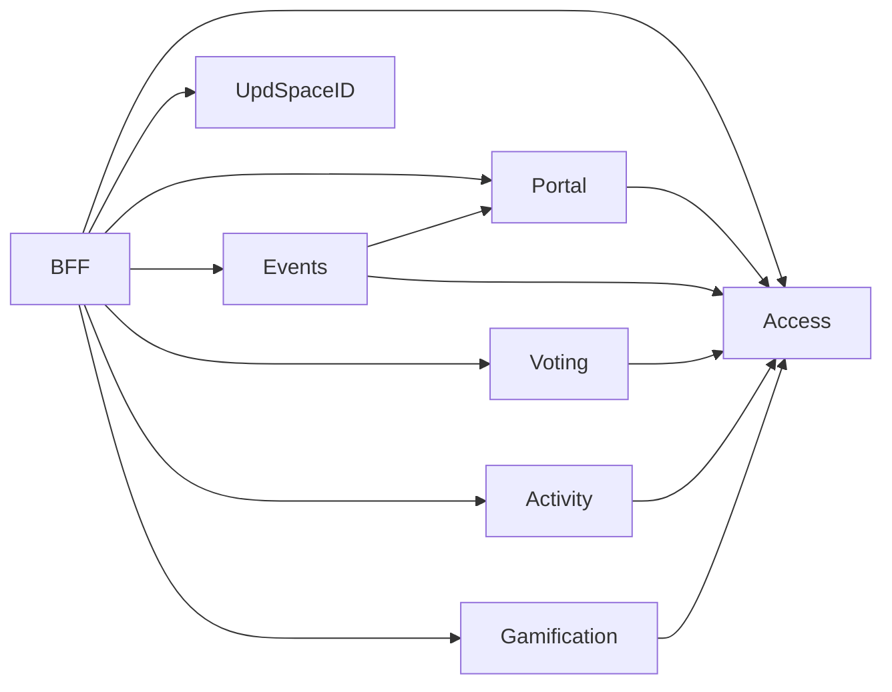

# Services Overview

В платформе используются отдельные Django-сервисы с собственными БД и довольно четкими обязанностями. Ниже дан инженерный, а не маркетинговый обзор.

## Service map

| Service | In repo | Main responsibility | Primary consumers |
| --- | --- | --- | --- |
| UpdSpaceID | external | identity, OIDC, MFA, passkeys | BFF, login flows |
| BFF | yes | browser gateway, session, auth proxy, tenant resolution | frontend |
| Access | yes | RBAC, rollout, personalization | BFF and internal services |
| Portal | yes | tenant profiles, communities, teams, posts | BFF, Events |
| Voting | yes | polls, nominations, results, legacy voting compat | BFF, frontend |
| Events | yes | calendar, RSVP, attendance, ICS | BFF, frontend |
| Activity | yes | feed, news, connectors, subscriptions | BFF, frontend |
| Gamification | yes | achievements, grants, categories | BFF, frontend |

## Service-to-service dependency graph

```mermaid
flowchart LR
    BFF --> Access
    BFF --> Portal
    BFF --> Voting
    BFF --> Events
    BFF --> Activity
    BFF --> Gamification
    BFF --> UpdSpaceID

    Portal --> Access
    Events --> Access
    Events --> Portal
    Voting --> Access
    Activity --> Access
    Gamification --> Access
```

## Flow ownership by service

| Flow | Entry service | Downstream services |
| --- | --- | --- |
| Login and session bootstrap | BFF | UpdSpaceID, Access, Portal |
| Tenant admin and permissions | BFF | Access |
| Profile and community UX | BFF | Portal, Access |
| Poll creation and voting | BFF | Voting, Access |
| Event visibility and RSVP | BFF | Events, Portal, Access |
| Achievements and grants | BFF | Gamification, Access |
| Feed, news, account links | BFF | Activity, Access |

## Read this section as a boundary map

Каждый сервисный раздел отвечает на одинаковые вопросы:

- чем владеет сервис;
- какие модели и API в нем главные;
- какие зависимости у него есть;
- что считать каноническим path для новой разработки;
- какие legacy/transition зоны нужно знать.

## Current repo boundaries

Важно: в этом репозитории **нет локального кода identity frontend и самого UpdSpaceID**. Они присутствуют в dev topology как внешние зависимости. Поэтому документация по identity здесь описывает boundary и contract, но не внутреннюю реализацию сервиса.
