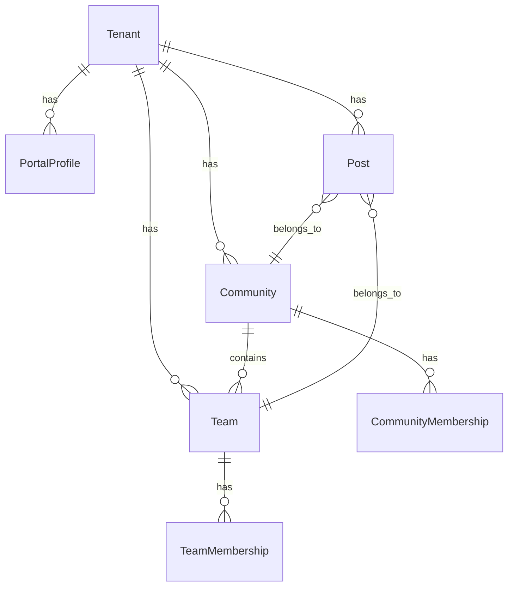

# Модели Portal Core

## ER Диаграмма



## Tenant

```python
class Tenant(models.Model):
    """Локальная копия tenant из ID"""
    id = models.UUIDField(primary_key=True)
    slug = models.CharField(max_length=50, unique=True)
    name = models.CharField(max_length=255)
    
    class Meta:
        db_table = "portal_tenants"
```

## PortalProfile

```python
class PortalProfile(models.Model):
    """Профиль пользователя в контексте portal tenant"""
    id = models.UUIDField(primary_key=True, default=uuid.uuid4)
    tenant_id = models.UUIDField(db_index=True)
    user_id = models.UUIDField(db_index=True)
    
    first_name = models.CharField(max_length=100, blank=True)
    last_name = models.CharField(max_length=100, blank=True)
    bio = models.TextField(blank=True)
    
    created_at = models.DateTimeField(auto_now_add=True)
    updated_at = models.DateTimeField(auto_now=True)
    
    class Meta:
        db_table = "portal_profiles"
        constraints = [
            models.UniqueConstraint(
                fields=["tenant_id", "user_id"],
                name="unique_portal_profile"
            )
        ]
```

## Community

```python
class Community(models.Model):
    """Сообщество внутри tenant"""
    id = models.UUIDField(primary_key=True, default=uuid.uuid4)
    tenant_id = models.UUIDField(db_index=True)
    
    name = models.CharField(max_length=255)
    slug = models.CharField(max_length=100)
    description = models.TextField(blank=True)
    logo_url = models.URLField(blank=True)
    
    created_by = models.UUIDField()
    created_at = models.DateTimeField(auto_now_add=True)
    updated_at = models.DateTimeField(auto_now=True)
    
    class Meta:
        db_table = "portal_communities"
        constraints = [
            models.UniqueConstraint(
                fields=["tenant_id", "slug"],
                name="unique_community_slug"
            )
        ]
```

## CommunityMembership

```python
class CommunityMembership(models.Model):
    """Членство пользователя в сообществе"""
    id = models.UUIDField(primary_key=True, default=uuid.uuid4)
    tenant_id = models.UUIDField(db_index=True)
    community_id = models.UUIDField(db_index=True)
    user_id = models.UUIDField(db_index=True)
    
    role_hint = models.CharField(max_length=50, blank=True)
    # Фактическая роль через Access RoleBinding
    
    joined_at = models.DateTimeField(auto_now_add=True)
    
    class Meta:
        db_table = "portal_community_memberships"
        constraints = [
            models.UniqueConstraint(
                fields=["tenant_id", "community_id", "user_id"],
                name="unique_community_membership"
            )
        ]
```

## Team

```python
class TeamStatus(str, Enum):
    ACTIVE = "active"
    ARCHIVED = "archived"


class Team(models.Model):
    """Команда внутри сообщества"""
    id = models.UUIDField(primary_key=True, default=uuid.uuid4)
    tenant_id = models.UUIDField(db_index=True)
    community_id = models.UUIDField(db_index=True)
    
    name = models.CharField(max_length=255)
    slug = models.CharField(max_length=100)
    description = models.TextField(blank=True)
    
    status = models.CharField(
        max_length=20,
        default=TeamStatus.ACTIVE,
        choices=[(s.value, s.value) for s in TeamStatus]
    )
    
    created_by = models.UUIDField()
    created_at = models.DateTimeField(auto_now_add=True)
    
    class Meta:
        db_table = "portal_teams"
        constraints = [
            models.UniqueConstraint(
                fields=["tenant_id", "community_id", "slug"],
                name="unique_team_slug"
            )
        ]
```

## TeamMembership

```python
class TeamMembership(models.Model):
    """Членство пользователя в команде"""
    id = models.UUIDField(primary_key=True, default=uuid.uuid4)
    tenant_id = models.UUIDField(db_index=True)
    team_id = models.UUIDField(db_index=True)
    user_id = models.UUIDField(db_index=True)
    
    role_hint = models.CharField(max_length=50, blank=True)
    
    joined_at = models.DateTimeField(auto_now_add=True)
    
    class Meta:
        db_table = "portal_team_memberships"
        constraints = [
            models.UniqueConstraint(
                fields=["tenant_id", "team_id", "user_id"],
                name="unique_team_membership"
            )
        ]
```

## Post

```python
class Visibility(str, Enum):
    PUBLIC = "public"
    COMMUNITY = "community"
    TEAM = "team"
    PRIVATE = "private"


class Post(models.Model):
    """Пост/новость"""
    id = models.UUIDField(primary_key=True, default=uuid.uuid4)
    tenant_id = models.UUIDField(db_index=True)
    
    # Scope (optional, для видимости)
    community_id = models.UUIDField(null=True, db_index=True)
    team_id = models.UUIDField(null=True, db_index=True)
    
    title = models.CharField(max_length=255)
    body = models.TextField()
    
    visibility = models.CharField(
        max_length=20,
        default=Visibility.PUBLIC,
        choices=[(v.value, v.value) for v in Visibility]
    )
    
    created_by = models.UUIDField()
    created_at = models.DateTimeField(auto_now_add=True)
    updated_at = models.DateTimeField(auto_now=True)
    
    class Meta:
        db_table = "portal_posts"
        indexes = [
            models.Index(fields=["tenant_id", "created_at"]),
            models.Index(fields=["tenant_id", "visibility"]),
        ]
```

## Индексы

Для производительности:

```sql
-- Быстрый поиск профилей
CREATE INDEX idx_profiles_tenant_user 
ON portal_profiles(tenant_id, user_id);

-- Посты по дате
CREATE INDEX idx_posts_tenant_created 
ON portal_posts(tenant_id, created_at DESC);

-- Членства
CREATE INDEX idx_community_members_user 
ON portal_community_memberships(tenant_id, user_id);
```
