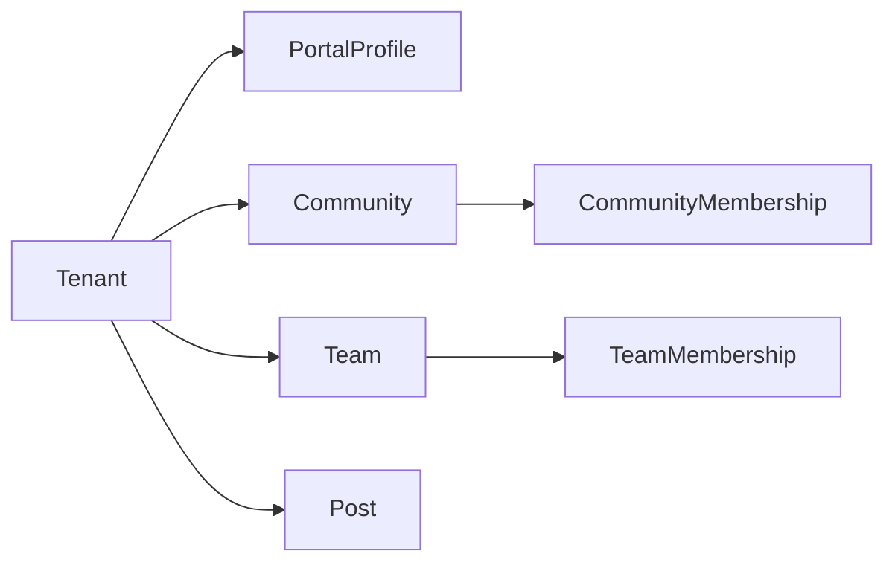

# Portal Domain Model

## Main models

| Model | Role |
| --- | --- |
| `Tenant` | local tenant projection used by portal domain |
| `PortalProfile` | tenant-local profile of a user |
| `Community` | top-level community unit |
| `CommunityMembership` | user membership in community |
| `Team` | team inside tenant |
| `TeamMembership` | user membership in team |
| `Post` | lightweight tenant post/feed entry |

## Relationship sketch

```mermaid
flowchart LR
    Tenant["Tenant"]
    Profile["PortalProfile"]
    Community["Community"]
    CommunityMembership["CommunityMembership"]
    Team["Team"]
    TeamMembership["TeamMembership"]
    Post["Post"]

    Tenant --> Profile
    Tenant --> Community
    Tenant --> Team
    Tenant --> Post
    Community --> CommunityMembership
    Team --> TeamMembership
```

## Data ownership notes

- `PortalProfile` не заменяет identity account; он хранит tenant-local presentation data.
- Membership models используются не только самим Portal, но и другими сервисами как источник community/team membership.
- `Post` сейчас остается относительно легким модулем; если появятся richer social features, возможно выделение отдельного контекста.
