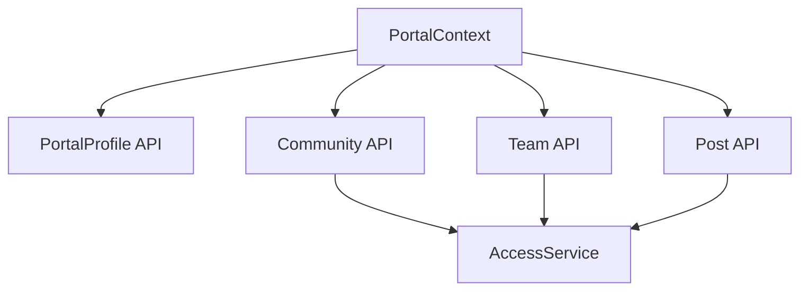
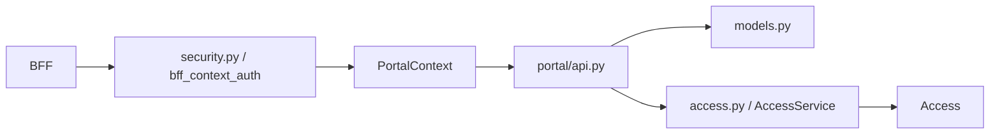

# Portal Overview

Portal - это доменный сервис, который хранит social and organizational core tenant-а:

- профиль участника;
- communities;
- teams;
- posts;
- membership relations.

## Main API surface

| Endpoint family | Purpose |
| --- | --- |
| `/portal/me` | own profile read/update |
| `/portal/profiles` | tenant profile listing and lookup |
| `/portal/modules` | enabled portal modules |
| `/communities` | communities CRUD-lite |
| `/teams` | teams CRUD-lite |
| `/posts` | tenant posts |

## Dependencies

Portal не использует shared auth state напрямую. Он получает `PortalContext` из BFF headers и ходит в Access за authorization.

## Module map

## Inbound and outbound graph

## Why other services care about Portal

Portal не только обслуживает собственный UI. Он также является membership authority для других доменов, в первую очередь для Events и частично для tenant-aware UX flows.

## What Portal is not

Portal не является:

- identity authority;
- global permission engine;
- feed service;
- event calendar;
- achievement engine.

Он владеет именно tenant social graph и организационными сущностями.
