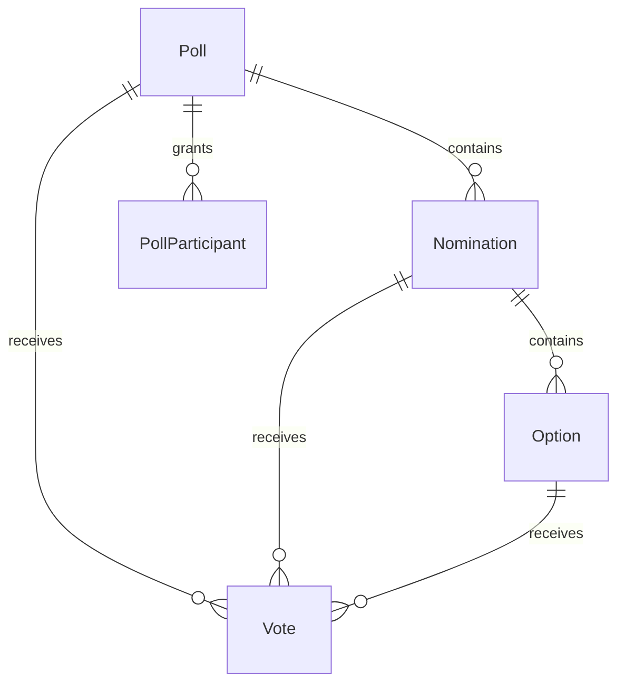

# Модели Voting Service

## Два модуля

### tenant_voting (новый)
Multi-tenant голосования для платформы.

### voting (legacy)
Оригинальный AEF-Vote, single-tenant.

---

## tenant_voting Models

### Статус

Описание ниже отражает целевую модель реформирования. На момент обновления
часть полей/сущностей отсутствует в коде и будет реализована обязательным
этапом. Кратко текущий MVP:

### MVP (реализовано сейчас)

- Poll: `id`, `tenant_id`, `title`, `status`, `scope_type`, `scope_id`, `visibility`,
  `created_by`, `starts_at`, `ends_at`, `created_at`, `updated_at`.
- Nomination: `id`, `poll`, `title`, `sort`.
- Option: `id`, `nomination`, `title`, `media_ref`.
- Vote: уникальность по `(tenant_id, poll_id, nomination_id, user_id)`.
- OutboxMessage: `tenant_id`, `event_type`, `payload`, `occurred_at`, `published_at`.

### Целевая модель (реформирование)

### ER Диаграмма



### Poll

```python
class PollStatus(str, Enum):
    DRAFT = "draft"      # Черновик, не виден пользователям
    ACTIVE = "active"    # Активное голосование
    CLOSED = "closed"    # Закрыто, результаты доступны


class PollScopeType(str, Enum):
    TENANT = "TENANT"       # На весь tenant
    COMMUNITY = "COMMUNITY" # Для сообщества
    TEAM = "TEAM"           # Для команды
    EVENT = "EVENT"         # Привязано к событию
    POST = "POST"           # Привязано к посту


class Poll(models.Model):
    id = models.UUIDField(primary_key=True, default=uuid.uuid4)
    tenant_id = models.UUIDField(db_index=True)
    
    title = models.CharField(max_length=255)
    description = models.TextField(blank=True)
    
    status = models.CharField(
        max_length=20,
        default=PollStatus.DRAFT,
        choices=[(s.value, s.value) for s in PollStatus]
    )
    
    # Scope: где показывается голосование
    scope_type = models.CharField(
        max_length=20,
        default=PollScopeType.TENANT,
        choices=[(s.value, s.value) for s in PollScopeType]
    )
    scope_id = models.CharField(max_length=128)  # UUID/ID сущности
    
    # Visibility: кто может видеть
    visibility = models.CharField(max_length=20, default="public")
    
    # Timing
    starts_at = models.DateTimeField(null=True)
    ends_at = models.DateTimeField(null=True)

    template = models.CharField(max_length=32, blank=True, default="")
    allow_revoting = models.BooleanField(default=False)
    anonymous = models.BooleanField(default=False)

    results_visibility = models.CharField(
        max_length=20,
        choices=[
            ("always", "always"),
            ("after_closed", "after_closed"),
            ("admins_only", "admins_only"),
        ],
        default="after_closed",
    )
    settings = models.JSONField(default=dict, blank=True)
    
    # Audit
    created_by = models.UUIDField()
    created_at = models.DateTimeField(auto_now_add=True)
    updated_at = models.DateTimeField(auto_now=True)
    
    class Meta:
        db_table = "voting_poll"
        indexes = [
            models.Index(fields=["tenant_id", "status"]),
            models.Index(fields=["tenant_id", "scope_type", "scope_id"]),
        ]
```

### Nomination

```python
class NominationKind(str, Enum):
    GAME = "game"       # Голосование за игру
    REVIEW = "review"   # Голосование за отзыв
    PERSON = "person"   # Голосование за человека
    CUSTOM = "custom"   # Произвольное


class Nomination(models.Model):
    id = models.UUIDField(primary_key=True, default=uuid.uuid4)
    tenant_id = models.UUIDField(db_index=True)
    poll = models.ForeignKey(Poll, on_delete=models.CASCADE, related_name="nominations")
    
    title = models.CharField(max_length=255)
    description = models.TextField(blank=True)
    
    kind = models.CharField(
        max_length=20,
        default=NominationKind.CUSTOM,
        choices=[(k.value, k.value) for k in NominationKind]
    )
    
    sort_order = models.IntegerField(default=0)
    
    # Сколько опций можно выбрать (обычно 1)
    max_votes = models.IntegerField(default=1)
    is_required = models.BooleanField(default=False)
    config = models.JSONField(default=dict, blank=True)
    
    class Meta:
        db_table = "voting_nomination"
        ordering = ["sort_order"]
```

### Option

```python
class Option(models.Model):
    id = models.UUIDField(primary_key=True, default=uuid.uuid4)
    tenant_id = models.UUIDField(db_index=True)
    nomination = models.ForeignKey(Nomination, on_delete=models.CASCADE, related_name="options")
    
    title = models.CharField(max_length=255)
    description = models.TextField(blank=True)
    
    # Медиа (картинка, обложка игры)
    media_url = models.URLField(blank=True)
    
    # Для kind=game
    game_id = models.UUIDField(null=True)
    
    sort_order = models.IntegerField(default=0)
    
    class Meta:
        db_table = "voting_option"
        ordering = ["sort_order"]
```

### Vote

```python
class Vote(models.Model):
    id = models.UUIDField(primary_key=True, default=uuid.uuid4)
    tenant_id = models.UUIDField(db_index=True)
    
    poll = models.ForeignKey(Poll, on_delete=models.CASCADE)
    nomination = models.ForeignKey(Nomination, on_delete=models.CASCADE)
    option = models.ForeignKey(Option, on_delete=models.CASCADE)
    
    user_id = models.UUIDField(db_index=True)
    
    created_at = models.DateTimeField(auto_now_add=True)
    
    class Meta:
        db_table = "voting_vote"
        indexes = [
            models.Index(fields=["poll_id", "nomination_id"]),
            models.Index(fields=["user_id", "poll_id"]),
        ]
```

Примечание: в реформе жёсткая уникальность в БД снимается, лимит
`max_votes` контролируется сервисом. Повторный выбор одной опции
блокируется логикой на уровне API.

### PollParticipant

```python
class PollRole(models.TextChoices):
    OWNER = "owner"
    ADMIN = "admin"
    MODERATOR = "moderator"
    OBSERVER = "observer"
    PARTICIPANT = "participant"


class PollParticipant(models.Model):
    id = models.UUIDField(primary_key=True, default=uuid.uuid4)
    tenant_id = models.UUIDField(db_index=True)
    poll = models.ForeignKey(Poll, on_delete=models.CASCADE, related_name="participants")
    user_id = models.UUIDField(db_index=True)
    role = models.CharField(max_length=16, choices=PollRole.choices)
    added_at = models.DateTimeField(auto_now_add=True)

    class Meta:
        db_table = "voting_poll_participant"
        constraints = [
            models.UniqueConstraint(fields=["poll", "user_id"], name="voting_poll_participant_unique"),
        ]
```

### VoteOutbox

```python
class VoteOutbox(models.Model):
    """Outbox pattern для событий голосования"""
    id = models.UUIDField(primary_key=True, default=uuid.uuid4)
    
    event_type = models.CharField(max_length=50)  # vote.cast
    payload = models.JSONField()
    
    created_at = models.DateTimeField(auto_now_add=True)
    processed_at = models.DateTimeField(null=True, db_index=True)
    
    class Meta:
        db_table = "voting_outbox"
```

---

## Legacy voting Models

### Game

```python
class Game(models.Model):
    id = models.AutoField(primary_key=True)
    
    title = models.CharField(max_length=255)
    cover_url = models.URLField(blank=True)
    steam_id = models.CharField(max_length=50, blank=True)
    
    tags = models.JSONField(default=list)
```

### Voting (legacy)

```python
class Voting(models.Model):
    id = models.AutoField(primary_key=True)
    
    code = models.CharField(max_length=50, unique=True)  # "2025"
    title = models.CharField(max_length=255)
    
    deadline = models.DateTimeField()
    
    # Правила
    rules = models.JSONField(default=dict)
    
    is_active = models.BooleanField(default=True)
```

### Nomination (legacy)

```python
class LegacyNomination(models.Model):
    id = models.AutoField(primary_key=True)
    voting = models.ForeignKey(Voting, on_delete=models.CASCADE)
    
    title = models.CharField(max_length=255)
    kind = models.CharField(max_length=20)  # game, review, person, custom
    
    sort = models.IntegerField(default=0)
```

## Миграция legacy → tenant_voting

```python
def migrate_voting(legacy_voting: Voting, tenant_id: UUID):
    poll = Poll.objects.create(
        tenant_id=tenant_id,
        title=legacy_voting.title,
        status="active" if legacy_voting.is_active else "closed",
        ends_at=legacy_voting.deadline,
        scope_type="TENANT",
    )
    
    for legacy_nom in legacy_voting.nominations.all():
        nomination = Nomination.objects.create(
            poll=poll,
            title=legacy_nom.title,
            kind=legacy_nom.kind,
            sort_order=legacy_nom.sort,
        )
        
        for legacy_opt in legacy_nom.options.all():
            Option.objects.create(
                nomination=nomination,
                title=legacy_opt.title,
                media_url=legacy_opt.cover_url or "",
                game_id=get_game_id(legacy_opt.game_id) if legacy_opt.game_id else None,
            )
```
