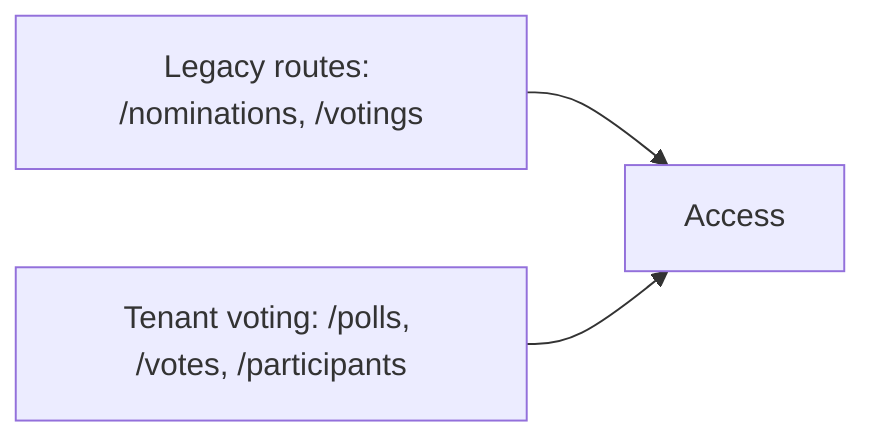
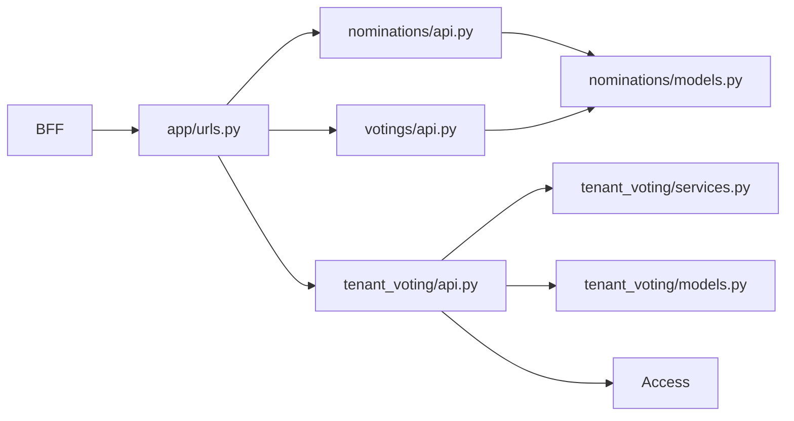

# Voting Overview

Voting сейчас находится в переходном состоянии. В сервисе живут **два слоя**:

- legacy API на `nominations` и `votings`;
- новый tenant-aware API в `tenant_voting`.

Это главное, что нужно понимать перед любой доработкой.

## Two-track structure

## What should be used for new work

Для новой функциональности, тестов и UI ориентируйтесь на:

- `tenant_voting/models.py`
- `tenant_voting/api.py`
- маршруты `/polls`, `/votes`, `/participants`

Legacy surface имеет смысл только как compat layer и до миграции исторических сценариев.

## Main responsibilities

- создание и публикация poll-ов;
- nominations и options внутри poll-а;
- cast/remove votes;
- poll participants;
- results and templates;
- compat API для старых consumers.

## Dependencies

Voting не доверяет browser auth напрямую. Он получает internal context и сам делает checks в Access по HMAC-signed service calls.

## Internal architecture graph

## Inbound flow split

- legacy consumers проходят через `/nominations` и `/votings`;
- новые poll workflows идут через `/polls`, `/votes`, `/participants`;
- frontend и новые сервисные доработки должны по возможности оставаться на tenant-aware track.
